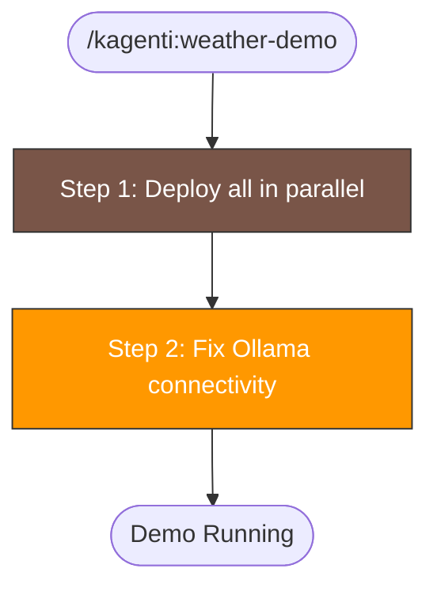

# Weather Agent Demo (CLI)

Deploy the Weather Service agent and Weather Tool without the Kagenti UI.
Uses existing CI scripts and Kubernetes manifests for a fully CLI-driven workflow.
Optimized for speed: pre-built images from ghcr.io, all commands in parallel, no waits.

## When to Use

- User wants to run the weather agent demo without the UI
- User asks "deploy weather demo", "deploy weather agent", or "run weather demo via CLI"
- User wants a quick end-to-end test of agent + tool deployment

## Prerequisites

- Kagenti platform deployed (via `scripts/kind/setup-kagenti.sh` or equivalent)
- `kubectl` configured and pointing at the target cluster
- Ollama running locally with `llama3.2:3b-instruct-fp16` model, OR an OpenAI API key

## Context-Safe Execution (MANDATORY)

Deploy/build commands produce large output. Use `run_in_background: true` on the Bash
tool to keep output out of context. Do NOT use shell redirects (`> file 2>&1`) as they
break permission matching.

Before running any commands, record the start time:

```bash
date +%s
```

> Remember this value as the start timestamp. Do NOT redirect to a file.

## Workflow



> Follow this diagram as the workflow. Do NOT add verification or testing steps beyond Step 2.

## Step 1: Deploy All in Parallel

Both images are pre-built on `ghcr.io/kagenti/agent-examples/`. The namespace setup
is a no-op if team1 already exists. Launch **all three as parallel Bash tool calls**:

**Bash call 1** — Setup team1 namespace:
```bash
./.github/scripts/kagenti-operator/70-setup-team1-namespace.sh
```

**Bash call 2** — Deploy weather-service agent:
```bash
./.github/scripts/kagenti-operator/74-deploy-weather-agent.sh
```

**Bash call 3** — Deploy weather-tool:
```bash
./.github/scripts/kagenti-operator/72-deploy-weather-tool.sh
```

> IMPORTANT: All three commands MUST be run as parallel Bash tool calls with
> `run_in_background: true` and `timeout: 600000` (three separate Bash invocations
> in the same response). Then wait for all to complete using TaskOutput.

## Step 2: Fix Ollama Connectivity (REQUIRED on Kind)

The deployment manifest defaults to `LLM_API_BASE=http://dockerhost:11434/v1` which
does not resolve inside Kind. Patch directly with `host.docker.internal`:

```bash
kubectl patch deployment weather-service -n team1 --type=strategic -p '{"spec":{"template":{"spec":{"containers":[{"name":"agent","env":[{"name":"LLM_API_BASE","value":"http://host.docker.internal:11434/v1"},{"name":"LLM_MODEL","value":"llama3.2:3b-instruct-fp16"}]}]}}}}'
```

> On Docker Desktop (macOS/Windows), use `host.docker.internal`.
> On Podman, use `host.containers.internal`.
> Do NOT wait for rollout — skip `kubectl rollout status` to save time.

Then report elapsed time:

```bash
date +%s
```

> Compute elapsed seconds by subtracting this value from the start timestamp recorded
> earlier. Report the difference in the completion message.

## Done

Report the elapsed time. Do NOT run any additional verification, pod checks, log checks,
or end-to-end curl tests.

## LLM Configuration

### Switch to OpenAI

```bash
kubectl create secret generic openai-secret -n team1 \
  --from-literal=apikey="<YOUR_OPENAI_API_KEY>"

kubectl set env deployment/weather-service -n team1 -c agent \
  LLM_API_BASE="https://api.openai.com/v1" \
  LLM_MODEL="gpt-4o-mini-2024-07-18"

kubectl patch deployment weather-service -n team1 --type=json -p='[
  {"op":"add","path":"/spec/template/spec/containers/0/env/-","value":{
    "name":"LLM_API_KEY",
    "valueFrom":{"secretKeyRef":{"name":"openai-secret","key":"apikey"}}
  }},
  {"op":"add","path":"/spec/template/spec/containers/0/env/-","value":{
    "name":"OPENAI_API_KEY",
    "valueFrom":{"secretKeyRef":{"name":"openai-secret","key":"apikey"}}
  }}
]'
```

## Cleanup

Since both images are pulled from ghcr.io (no Shipwright builds), cleanup is just
deleting the deployments and services:

```bash
kubectl delete deployment weather-service weather-tool -n team1 --ignore-not-found
kubectl delete svc weather-service weather-tool-mcp -n team1 --ignore-not-found
```

Or delete the entire namespace:

```bash
kubectl delete namespace team1
```

## Troubleshooting

### Agent Can't Reach Ollama

See [Step 2: Fix Ollama Connectivity](#step-2-fix-ollama-connectivity-required-on-kind) above.

| Container runtime | Hostname |
|-------------------|----------|
| Docker Desktop | `host.docker.internal` |
| Podman (macOS) | `host.containers.internal` |
| Kind default | `dockerhost` (usually doesn't resolve) |

### Agent Can't Reach Weather Tool

```bash
kubectl get svc -n team1 | grep weather-tool
# Should show: weather-tool-mcp   ClusterIP   ...   8000/TCP
```

The default `MCP_URL` is `http://weather-tool-mcp.team1.svc.cluster.local:8000/mcp`.

## Related Skills

- `kagenti:agent` - Create custom A2A agents from scratch
- `kagenti:operator` - Deploy Kagenti platform and demo agents
- `kagenti:deploy` - Deploy Kind cluster
- `k8s:pods` - Debug pod issues
- `k8s:logs` - Query component logs
