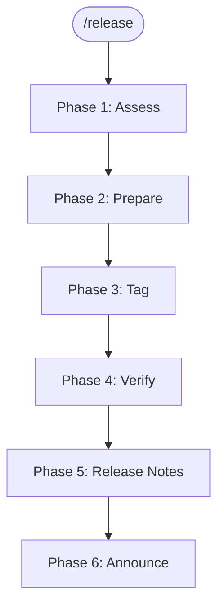

> Follow this diagram as the workflow. Reference `docs/releasing.md` for the
> full maintainer guide.

# Release Kagenti

Guided workflow for creating tagged releases across the Kagenti organization.
Handles the multi-repo dependency order, image tag pinning, artifact
verification, and release notes.

## Table of Contents

- [When to Use](#when-to-use)
- [Invocation](#invocation)
- [Phase 1: Assess Current State](#phase-1-assess-current-state)
- [Phase 2: Prepare the Release](#phase-2-prepare-the-release)
- [Phase 3: Tag Repos](#phase-3-tag-repos)
- [Phase 4: Verify Artifacts](#phase-4-verify-artifacts)
- [Phase 5: Release Notes](#phase-5-release-notes)
- [Phase 6: Announce](#phase-6-announce)
- [Quick Reference: Release Types](#quick-reference-release-types)
- [Related Skills](#related-skills)

## When to Use

- Cutting an alpha, RC, GA, or patch release for any Kagenti repo
- Coordinating a multi-repo release across the organization
- Verifying that all release artifacts were produced correctly

## Invocation

```
/release alpha vX.Y.0-alpha.N          # Cut an alpha release
/release rc vX.Y.0-rc.N                # Cut a release candidate
/release ga vX.Y.0                     # Cut a GA release
/release patch vX.Y.Z                  # Cut a patch release
/release status                        # Show current release state across repos
```

If no arguments are given, start with Phase 1 to assess and ask the user what
type of release to cut.

## Phase 1: Assess Current State

Gather the current release landscape before making any changes.

### 1.1 Current tags across repos

```bash
echo "=== kagenti/kagenti ==="
gh release list --repo kagenti/kagenti --limit 5

echo "=== kagenti/kagenti-extensions ==="
gh release list --repo kagenti/kagenti-extensions --limit 5

echo "=== kagenti/kagenti-operator ==="
gh release list --repo kagenti/kagenti-operator --limit 5

echo "=== kagenti/agent-examples ==="
gh release list --repo kagenti/agent-examples --limit 5
```

### 1.2 Chart dependency versions

```bash
grep -A2 'name: kagenti-' charts/kagenti/Chart.yaml
```

### 1.3 Image tags in values.yaml

```bash
grep -n 'tag:' charts/kagenti/values.yaml
```

Flag any `tag: latest` entries — these must be pinned before any release (including alphas).

### 1.4 Determine release type

Present the user with a summary built from the live data gathered in 1.1–1.3:

```
Current state:
  kagenti:            <latest GA tag> (GA), <latest pre-release tag> (latest pre-release)
  kagenti-extensions: <latest pre-release tag> (latest pre-release), <latest GA tag> (GA)
  kagenti-operator:   <latest pre-release tag> (latest pre-release)

Chart.yaml pins:
  kagenti-webhook-chart: <version from Chart.yaml>
  kagenti-operator-chart: <version from Chart.yaml>

Image tag issues:
  <N> images using tag: latest (must fix before RC/GA)
```

**IMPORTANT:** Always use the LIVE values from steps 1.1–1.3. Never copy stale
versions from this skill file — hardcoded examples drift and cause releases to
pin outdated dependencies.

Ask: "What release would you like to cut? (alpha / rc / ga / patch)"

## Phase 2: Prepare the Release

Steps depend on the release type. Always follow the dependency order:

```
1. kagenti/kagenti-operator     →  first
2. kagenti/kagenti-extensions   →  second
3. kagenti/agent-examples       →  third (if applicable)
4. kagenti/kagenti              →  last (update Chart.yaml + values.yaml, then tag)
```

### 2.1 For Alpha

Alphas are tagged from `main` with all image tags pinned.

- [ ] Confirm CI passes on `main` for each repo being tagged
- [ ] Determine next alpha number for each repo
- [ ] Dependency repos tagged with alpha first
- [ ] `charts/kagenti/Chart.yaml` updated with alpha sub-chart versions
- [ ] `helm dependency update charts/kagenti/` run to regenerate `Chart.lock`
- [ ] **All `tag: latest` in `charts/kagenti/values.yaml` replaced** with alpha tag
- [ ] `ui.tag` and `backend.tag` updated to the alpha tag

### 2.2 For RC

- [ ] All planned features merged; feature freeze in effect
- [ ] No known critical or blocking bugs
- [ ] Dependency repos tagged with RC first
- [ ] `charts/kagenti/Chart.yaml` updated with RC sub-chart versions
- [ ] `helm dependency update charts/kagenti/` run to regenerate `Chart.lock`
- [ ] **All `tag: latest` in `charts/kagenti/values.yaml` replaced** with RC tag
- [ ] `ui.tag` and `backend.tag` updated to the RC tag
- [ ] Release branch created:

```bash
git checkout -b release-X.Y main
git push origin release-X.Y
```

### 2.3 For GA

- [ ] At least one RC validated (minimum 1 week soak recommended)
- [ ] No open release-blocking issues
- [ ] At least one maintainer sign-off
- [ ] Dependency repos tagged with GA first
- [ ] `charts/kagenti/Chart.yaml` updated with GA sub-chart versions
- [ ] `helm dependency update charts/kagenti/` regenerates `Chart.lock`
- [ ] **All image tags in `charts/kagenti/values.yaml` pinned to GA tag**
- [ ] Documentation reviewed and updated

### 2.4 For Patch

- [ ] Fix(es) cherry-picked into `release-X.Y` branch
- [ ] CI passes on the release branch
- [ ] For non-trivial fixes, consider an RC first (`vX.Y.Z-rc.1`)

### Pin image tags helper

Run this to find and display all images that need pinning:

```bash
echo "=== Images using 'latest' tag ==="
grep -n 'tag: latest' charts/kagenti/values.yaml

echo ""
echo "=== All image:tag pairs ==="
grep -n 'tag:\|image:' charts/kagenti/values.yaml

echo ""
echo "=== Hardcoded :latest in templates ==="
grep -rn ':latest' charts/kagenti/templates/
```

## Phase 3: Tag Repos

For each repo in dependency order, create and push the signed tag.

**CRITICAL:** After tagging each dependency repo, run the verification in 3.2
and get explicit user approval BEFORE proceeding to the next repo.

### 3.1 Tag a dependency repo

```bash
# Clone (or cd into) the repo — clean up first if dir exists from a previous attempt
rm -rf /tmp/kagenti-release/<repo-name>
gh repo clone kagenti/<repo-name> /tmp/kagenti-release/<repo-name>
cd /tmp/kagenti-release/<repo-name>

# Verify CI passes on main
gh run list --branch main --limit 3

# Determine next tag
git tag --list 'v*' --sort=-v:refname | head -5

# Create signed tag (requires GPG to be configured; use -a instead of -s for unsigned annotated tags)
git tag -s <version> -m "<version>"
git push origin <version>

# Wait for CI to complete (watches the latest workflow run until it finishes)
gh run watch
```

### 3.2 Verify each repo before proceeding (MANDATORY)

After tagging a dependency repo and its CI completes, run these checks
**before moving to the next repo**:

```bash
REPO="kagenti/<repo-name>"
TAG="<version just tagged>"

# 1. Show the tag commit and verify it's what we expect
echo "=== Tag commit ==="
gh api /repos/$REPO/git/refs/tags/$TAG --jq '.object.sha'

# 2. List PRs merged since the PREVIOUS tag to confirm expected changes are included
PREV_TAG="<previous tag>"
echo "=== PRs included ($PREV_TAG → $TAG) ==="
gh api /repos/$REPO/compare/$PREV_TAG...$TAG --jq '.commits[] | "\(.sha[:12]) \(.commit.message | split("\n")[0])"'

# 3. Verify container images were built for this tag
echo "=== Container images ==="
for img in <list images for this repo>; do
  echo -n "$img:$TAG ... "
  docker manifest inspect ghcr.io/kagenti/$REPO_PATH/$img:$TAG >/dev/null 2>&1 \
    && echo "OK" || echo "MISSING"
done
```

Present the results and **ask the user to confirm** before proceeding:

```
✅ kagenti/<repo-name> $TAG verified:
  - Tag points to: <commit sha> (<commit message>)
  - Includes <N> commits since $PREV_TAG
  - Key PRs: #<pr1> <title>, #<pr2> <title>
  - Container images: all present

Proceed to next repo? (yes / no / show full diff)
```

**Do NOT proceed to the next repo or update Chart.yaml/values.yaml until the
user confirms.** If any image is missing or an expected PR is not included,
stop and investigate.

### 3.3 Tag kagenti/kagenti (last)

After all dependency repos are tagged and their CI has completed:

```bash
cd /tmp/kagenti-repo  # or wherever kagenti/kagenti is cloned

# Verify Chart.yaml and values.yaml are updated
grep -A2 'name: kagenti-' charts/kagenti/Chart.yaml
grep -n 'tag: latest' charts/kagenti/values.yaml  # should return nothing

# Create signed tag (requires GPG to be configured; use -a instead of -s for unsigned annotated tags)
git tag -s <version> -m "<version>"
git push origin <version>
```

## Phase 4: Verify Artifacts

After tagging, verify that CI produced all expected artifacts.

### 4.1 GitHub Releases

```bash
for repo in kagenti kagenti-extensions kagenti-operator; do
  echo "=== kagenti/$repo ==="
  gh release view <version> --repo kagenti/$repo --json tagName,isPrerelease,publishedAt 2>/dev/null || echo "  Not found"
done
```

### 4.2 Container images

```bash
REGISTRY="ghcr.io/kagenti"
VERSION="<version>"

# kagenti/kagenti images
for img in ui-v2 backend ui-oauth-secret agent-oauth-secret api-oauth-secret; do
  echo -n "$img:$VERSION ... "
  gh api -H "Accept: application/vnd.github.v3+json" \
    "/orgs/kagenti/packages/container/kagenti%2F$img/versions" \
    --jq ".[].metadata.container.tags[] | select(. == \"$VERSION\")" 2>/dev/null \
    && echo "OK" || echo "MISSING"
done

# kagenti-extensions images
for img in envoy-with-processor proxy-init client-registration; do
  echo -n "$img:$VERSION ... "
  gh api -H "Accept: application/vnd.github.v3+json" \
    "/orgs/kagenti/packages/container/kagenti-extensions%2F$img/versions" \
    --jq ".[].metadata.container.tags[] | select(. == \"$VERSION\")" 2>/dev/null \
    && echo "OK" || echo "MISSING"
done
```

### 4.3 Helm charts

```bash
# Check OCI registry for charts
helm show chart oci://ghcr.io/kagenti/kagenti-extensions/kagenti-webhook-chart --version <chart-version> 2>/dev/null \
  && echo "webhook chart OK" || echo "webhook chart MISSING"

helm show chart oci://ghcr.io/kagenti/kagenti-operator/kagenti-operator-chart --version <chart-version> 2>/dev/null \
  && echo "operator chart OK" || echo "operator chart MISSING"
```

### 4.4 Pre-release flag

For alpha and RC releases, confirm the GitHub Release is marked as pre-release.
For GA releases, confirm it is marked as "Latest":

```bash
gh release view <version> --repo kagenti/kagenti --json isPrerelease --jq '.isPrerelease'
# Expected: true for alpha/RC, false for GA
```

## Phase 5: Release Notes

### For Alpha

Auto-generated changelog is sufficient. Optionally add a one-line summary of
known breaking changes from the previous alpha:

```bash
gh release edit <version> --repo kagenti/kagenti \
  --notes "Alpha release — auto-generated changelog below. Known issues: <list any>"
```

### For RC

Brief summary highlighting what changed since the last alpha or RC:

```bash
gh release edit <version> --repo kagenti/kagenti \
  --notes "Release candidate for vX.Y.0. Feature-complete; bug fixes only from here.

## Testing needed
- [ ] Clean Kind install
- [ ] OpenShift install
- [ ] Upgrade from previous GA
- [ ] E2E tests

## Changes since <previous-tag>
<auto-generated changelog>"
```

### For GA

Full release notes with component compatibility table:

```markdown
## Highlights
- Feature 1
- Feature 2

## Breaking Changes
- (list any)

## Component Versions

| Component | Version |
|-----------|---------|
| kagenti (platform) | vX.Y.0 |
| kagenti-extensions (webhook) | vA.B.0 |
| kagenti-operator | vC.D.0 |
| agent-examples | vE.F.0 |

## Upgrade Notes
- (any special steps for upgrading from previous GA)

## Full Changelog
<auto-generated>
```

Edit with:

```bash
gh release edit <version> --repo kagenti/kagenti --notes-file /tmp/release-notes.md
```

## Phase 6: Announce

For GA and significant RC releases:

```bash
echo "Announce the release on:"
echo "  - Slack: https://ibm.biz/kagenti-slack"
echo "  - Mailing list: kagenti-maintainers@googlegroups.com"
echo "  - Blog post (major releases)"
```

Draft an announcement message:

```
Kagenti vX.Y.0 is now available!

Highlights:
- <feature 1>
- <feature 2>

Install: https://github.com/kagenti/kagenti/blob/main/docs/install.md
Release notes: https://github.com/kagenti/kagenti/releases/tag/vX.Y.0
```

## Quick Reference: Release Types

| Type | Branch | Pin images? | Release notes | Announce? |
|------|--------|-------------|---------------|-----------|
| Alpha | `main` | **Yes** — no `latest` | Auto-generated | No |
| RC | `release-X.Y` | **Yes** — no `latest` | Summary + testing checklist | Team only |
| GA | `release-X.Y` | **Yes** — no `latest` | Full notes + compatibility table | Public |
| Patch | `release-X.Y` | **Yes** — no `latest` | Brief fix description | Public |

## Related Skills

- `docs/releasing.md` — Full maintainer reference guide
- `git:commit` — Commit format conventions
- `github:pr-review` — PR review workflow
- `ci:status` — CI failure analysis
