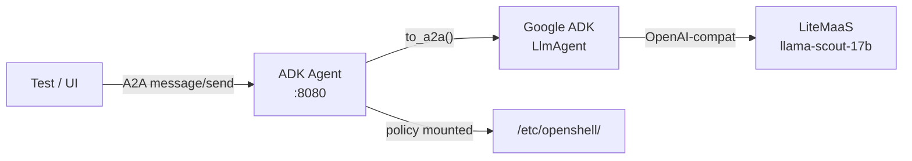

# ADK Agent (Google Agent Development Kit)

> Back to [agent catalog](README.md) | [main doc](../openshell-integration.md)
>
> **Type:** Custom A2A
> **Framework:** Google ADK + LiteLLM
> **LLM:** LiteMaaS (llama-scout-17b via LiteLLM proxy)
> **Supervisor:** Yes (supervised variant: Landlock + seccomp + netns + OPA)
> **Sandbox Model:** Tier 2 (Deployment with supervisor + port-bridge sidecar)
> **Status:** Deployed as `adk-agent-supervised`, all skill tests pass

## 1. Overview

PR review agent built with Google's Agent Development Kit (ADK). Uses the
`to_a2a()` wrapper to expose the agent via A2A JSON-RPC protocol. LLM calls
route through LiteLLM (OpenAI-compatible format) to LiteMaaS or Budget Proxy.

## 2. Architecture



## 3. Files

```
deployments/openshell/agents/adk-agent/
├── agent.py              # LlmAgent + review_pr tool + to_a2a() wrapper
├── Dockerfile            # python:3.12-slim
├── deployment.yaml       # Deployment + Service + AgentRuntime CR
├── policy-data.yaml      # OPA filesystem + network rules
├── sandbox-policy.rego   # OPA Rego deny/allow rules
└── requirements.txt      # google-adk, a2a-sdk, litellm
```

## 4. Deployment

```bash
# Kind
docker build -t adk-agent:latest deployments/openshell/agents/adk-agent/
kind load docker-image adk-agent:latest --name kagenti

# OCP (binary build)
oc -n team1 new-build --binary --strategy=docker --name=adk-agent
oc -n team1 start-build adk-agent --from-dir=deployments/openshell/agents/adk-agent/ --follow

kubectl apply -f deployments/openshell/agents/adk-agent/deployment.yaml
```

## 5. Capabilities

| Capability | Supported | Notes |
|-----------|-----------|-------|
| A2A protocol | **Yes** | Native via `to_a2a()` — auto-generates agent card |
| Multi-turn context | **Partial** | Returns `contextId` but creates new one per request (upstream gap) |
| Tool calling | **Yes** | `review_pr` tool registered with LlmAgent |
| Subagent delegation | **Yes** (ADK native) | ADK supports agents-as-tools, not yet used in PoC |
| Memory/knowledge | **In-memory** | ADK SessionService tracks session state; lost on pod restart |
| Skill execution | **Via prompt** | Kagenti skill markdown injected into LLM prompt |
| HITL approval | **L0** | OPA policy mounted but not enforced without supervisor |

### ADK-Specific Features

| ADK Feature | Available | Used in PoC? | Notes |
|------------|-----------|-------------|-------|
| `to_a2a()` wrapper | Yes | Yes | Auto A2A agent card + endpoint |
| SessionService | Yes | Implicit | In-memory sessions via to_a2a |
| ToolConfirmation (HITL) | Yes | No | ADK native pause-for-approval |
| RunState persistence | Yes | No | Snapshot + resume after approval |
| Multi-agent composition | Yes | No | Agents-as-tools pattern |
| Event streaming | Yes | No | Structured Event objects |
| DatabaseSessionService | Yes | No | Persistent sessions (PostgreSQL/SQLite) |
| Auto context windowing | Yes | Yes | Token budget management |

## 6. Kagenti Integration

### 6.1 Communication Adapter
**A2A JSON-RPC** (already implemented). The ADK `to_a2a()` wrapper handles
protocol translation natively.

### 6.2 Session Management
ADK provides `SessionService` with in-memory storage by default. For
persistent sessions, switch to `DatabaseSessionService` backed by
PostgreSQL or SQLite.

**Current:** In-memory (lost on restart)
**Target:** DatabaseSessionService → Kagenti PostgreSQL

### 6.3 Observable Events

| Event | Source | Kagenti UI Component | Phase |
|-------|--------|---------------------|-------|
| LLM request/response | ADK Event history | PromptInspector | Phase 2 |
| Tool call (review_pr) | ADK function_call Event | EventsPanel | Phase 2 |
| Tool result | ADK function_response Event | EventsPanel | Phase 2 |
| Token usage | ADK session metrics | LlmUsagePanel | Phase 2 |
| Context windowing | ADK auto-compression | SessionStatsPanel | Phase 3 |
| HITL approval (future) | ADK ToolConfirmation | HitlApprovalCard | Phase 3 |

### 6.4 FileBrowser Integration
N/A — custom A2A agent with no persistent workspace. If PVC is added,
ADK's session state could be browsed.

## 7. LLM Compatibility

| Provider | Protocol | Works? | Notes |
|----------|----------|--------|-------|
| LiteMaaS | OpenAI-compat | **Yes** | Current PoC config via `OPENAI_API_BASE` |
| Budget Proxy | OpenAI-compat | **Yes** | Default deployment config |
| Ollama | OpenAI-compat | **Yes** | For local Kind testing |
| Anthropic API | Claude messages | No | ADK uses OpenAI format |

## 8. Policy Configuration

```yaml
filesystem_policy:
  read_only: [/usr, /lib, /lib64, /etc, /home, /bin, /sbin]
  read_write: [/tmp, /app, /root, /var/log]
network_policies:
  internal:
    endpoints:
      - host: "*.svc.cluster.local"
        port: 8080
      - host: "*.svc.cluster.local"
        port: 443
  litemaas:
    endpoints:
      - host: "*.redhatworkshops.io"
        port: 443
```

## 9. Skill Execution

The ADK agent executes Kagenti skills by receiving the skill instructions
as part of the A2A prompt. The test infrastructure reads skill markdown from
`.claude/skills/<name>/SKILL.md` and embeds it in the `message/send` request.

### Supported Skills

| Skill | Test | Status | How It Works |
|-------|------|--------|-------------|
| PR Review | `test_pr_review__adk_agent` | **PASS** | Skill markdown from `github:pr-review` injected into prompt; agent uses `review_pr` tool |
| RCA | `test_rca__adk_agent` | **PASS** | Skill markdown from `rca:ci` injected; agent analyzes CI logs |
| Security Review | `test_security_review__adk_agent` | **PASS** | Prompt-based; agent reviews K8s manifests for security issues |
| Real GitHub PR | `test_review_real_github_pr__adk` | **PASS** | Fetches actual PR #1300 diff via GitHub API, reviews with LLM |
| TDD | Not tested | — | ADK can execute `test:review` skill via prompt injection |
| Docs Review | Not tested | — | ADK can execute `docs:review` skill via prompt injection |

### Running Skills Manually

```bash
# Port-forward to ADK agent
kubectl port-forward -n team1 svc/adk-agent 8001:8000 &

# PR Review skill
curl -s -X POST http://localhost:8001/ \
  -H "Content-Type: application/json" \
  -d '{
    "jsonrpc": "2.0", "id": "1", "method": "message/send",
    "params": {"message": {"role": "user",
      "parts": [{"type": "text", "text": "Review this PR diff for security issues:\n\n```diff\n- return os.popen(cmd).read()\n+ result = subprocess.run(cmd, shell=True)\n```"}]
    }}
  }' | python3 -m json.tool

# RCA skill
curl -s -X POST http://localhost:8001/ \
  -H "Content-Type: application/json" \
  -d '{
    "jsonrpc": "2.0", "id": "2", "method": "message/send",
    "params": {"message": {"role": "user",
      "parts": [{"type": "text", "text": "Root cause analysis: test_login failed with 200 != 302 after auth middleware JWT expiry change"}]
    }}
  }' | python3 -m json.tool

kill %1
```

### Prerequisites

- LiteLLM model proxy running in `team1` (provides OpenAI-compatible endpoint)
- `OPENSHELL_LLM_AVAILABLE=true` for E2E tests
- `.env.maas` with LiteMaaS credentials (or substitute your LLM endpoint)

## 10. Testing Status


| Test File | Tests | Pass | Skip | Notes |
|-----------|-------|------|------|-------|
| test_02_a2a_connectivity | 2 | 2 | 0 | Hello + agent card |
| test_05_multiturn | 3 | 2 | 1 | Sequential + isolation pass; continuity skips |
| test_07_skill_execution | 5 | 3 | 2 | PR review, RCA, security pass; real GH PR pass |
| test_T1_6_credential_security | 4 | 4 | 0 | secretKeyRef, no hardcoded keys |
| test_06_conversation_resume | 2 | 0 | 2 | Destructive-gated |

## 11. Sandbox Deployment Models

| Model | Supported | Notes |
|-------|-----------|-------|
| Mode 1: Kagenti Deployment | **Current** | Standard Deployment + Service |
| Mode 1 + Supervisor | Possible | Add supervisor; enables OPA enforcement |
| Mode 2: Sandbox CR | Not applicable | Not a builtin CLI agent |

### Future: ADK HITL Integration

ADK's `ToolConfirmation` pattern natively supports HITL:
1. Mark sensitive tools with `needsApproval: true`
2. ADK pauses execution and snapshots `RunState`
3. Kagenti backend receives pause event
4. `HitlApprovalCard` shown in UI
5. Human approves/rejects
6. ADK resumes from snapshot

This maps directly to HITL Level L3 (sync approval) and is the most
natural HITL integration point across all agent types.
