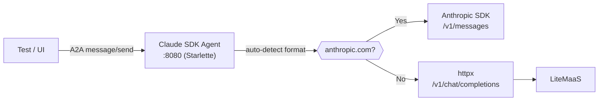

# Claude SDK Agent

> Back to [agent catalog](README.md) | [main doc](../openshell-integration.md)
>
> **Type:** Custom A2A
> **Framework:** Anthropic SDK / OpenAI-compatible (httpx)
> **LLM:** LiteMaaS (llama-scout-17b)
> **Supervisor:** No
> **Sandbox Model:** Tier 3 (plain Deployment, no supervisor)
> **Status:** Deployed, tested (Kind + HyperShift)

## 1. Overview

Code review agent using the Anthropic Python SDK with automatic format switching.
When `ANTHROPIC_BASE_URL` points to a non-Anthropic endpoint (e.g., LiteMaaS),
uses httpx with OpenAI chat/completions format. A2A protocol implemented manually
via Starlette (Anthropic SDK has no built-in A2A wrapper unlike Google ADK).

## 2. Architecture



## 3. Files

```
deployments/openshell/agents/claude-sdk-agent/
├── agent.py              # Starlette A2A server + Anthropic/OpenAI client
├── Dockerfile            # python:3.12-slim
├── deployment.yaml       # Deployment + Service + AgentRuntime CR
├── policy-data.yaml      # OPA policy
├── sandbox-policy.rego   # OPA Rego rules
└── requirements.txt      # anthropic, starlette, uvicorn, httpx
```

## 4. Deployment

Same as adk-agent (docker build + kind load, or OCP binary build).

## 5. Capabilities

| Capability | Supported | Notes |
|-----------|-----------|-------|
| A2A protocol | **Yes** | Manual Starlette implementation |
| Multi-turn context | **No** | Stateless — each request independent |
| Tool calling | No | LLM prompt-based only |
| Subagent delegation | No | Single-purpose agent |
| Memory/knowledge | No | No persistent state |
| Skill execution | **Via prompt** | Skill markdown injected into system prompt |
| HITL approval | L0 | OPA policy mounted, not enforced |

## 6. Kagenti Integration

### 6.1 Communication Adapter
A2A JSON-RPC (already implemented).

### 6.2 Session Management
None — stateless. Backend stores turns in PostgreSQL.

### 6.3 Observable Events

| Event | Source | Kagenti UI Component | Phase |
|-------|--------|---------------------|-------|
| LLM response | A2A response artifacts | AgentChat | Current |
| Error (LLM unavailable) | Generic error message | AgentChat | Current |

### 6.4 FileBrowser Integration
N/A — no workspace.

## 7. LLM Compatibility

| Provider | Protocol | Works? | Notes |
|----------|----------|--------|-------|
| LiteMaaS | OpenAI-compat | **Yes** | Auto-detected via base_url |
| Anthropic API | Claude messages | **Yes** | Native SDK |
| Budget Proxy | OpenAI-compat | **Yes** | Default config |

## 8. Skill Execution

The Claude SDK agent is the **most capable skill executor** in the PoC — it
supports all skill types and has the most passing skill tests. Skills are
injected by embedding the skill markdown (from `.claude/skills/<name>/SKILL.md`)
into the A2A prompt.

### Supported Skills

| Skill | Test | Status | How It Works |
|-------|------|--------|-------------|
| PR Review | `test_pr_review__claude_sdk_agent` | **PASS** | Skill markdown from `github:pr-review` injected into prompt |
| RCA | `test_rca__claude_sdk_agent` | **PASS** | Skill markdown from `rca:ci` injected; analyzes CI failure logs |
| Security Review | `test_security_review__claude_sdk_agent` | **PASS** | Prompt-based K8s manifest security analysis |
| Real GitHub PR | `test_review_real_github_pr__claude_sdk` | **PASS** | Fetches PR #1300 diff via GitHub API, reviews with LLM |
| RCA CI Logs | `test_rca_style_log_analysis__claude_sdk` | **PASS** | Analyzes real CI log output for root causes |
| Code Generation | `test_code_generation__claude_sdk` | **PASS** | Generates Python code from natural language prompt |
| TDD | Not tested | — | Can execute `test:review` skill via prompt injection |
| Docs Review | Not tested | — | Can execute `docs:review` skill via prompt injection |

### Running Skills Manually

```bash
# Port-forward to Claude SDK agent
kubectl port-forward -n team1 svc/claude-sdk-agent 8002:8000 &

# PR Review skill
curl -s -X POST http://localhost:8002/ \
  -H "Content-Type: application/json" \
  -d '{
    "jsonrpc": "2.0", "id": "1", "method": "message/send",
    "params": {"message": {"role": "user",
      "parts": [{"type": "text", "text": "Review this code change for issues:\n\n```diff\n- password = request.form[\"password\"]\n+ password = hashlib.md5(request.form[\"password\"]).hexdigest()\n```"}]
    }}
  }' | python3 -m json.tool

# RCA with real CI log
curl -s -X POST http://localhost:8002/ \
  -H "Content-Type: application/json" \
  -d '{
    "jsonrpc": "2.0", "id": "2", "method": "message/send",
    "params": {"message": {"role": "user",
      "parts": [{"type": "text", "text": "Analyze this CI failure:\n\nERROR: Connection refused to postgres:5432\nFATAL: role \"test_user\" does not exist\n\nContext: This started after we upgraded the PostgreSQL Helm chart from 14.x to 15.x"}]
    }}
  }' | python3 -m json.tool

kill %1
```

### Prerequisites

- LiteLLM model proxy running in `team1`
- `OPENSHELL_LLM_AVAILABLE=true` for E2E tests
- `.env.maas` with LiteMaaS credentials (or substitute your LLM endpoint)

## 9. Testing Status

| Test File | Tests | Pass | Skip | Notes |
|-----------|-------|------|------|-------|
| test_02_a2a_connectivity | 2 | 2 | 0 | Hello + agent card |
| test_05_multiturn | 3 | 2 | 1 | Sequential + isolation pass; continuity skips |
| test_07_skill_execution | 7 | 5 | 2 | PR review, RCA, security, real GH PR, RCA logs |

## 10. Sandbox Deployment Models

| Model | Supported | Notes |
|-------|-----------|-------|
| Mode 1: Kagenti Deployment | **Current** | Standard Deployment + Service |
| Mode 1 + Supervisor | Possible | Would enable OPA enforcement |
| Mode 2: Sandbox CR | Not applicable | Custom code, not a CLI agent |
