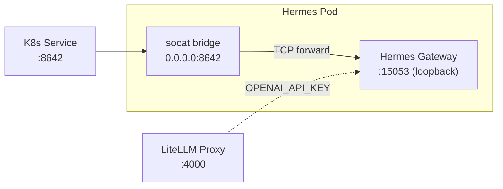

# NemoClaw Hermes Agent

> Back to [agent catalog](README.md) | [main doc](../openshell-integration.md)
>
> **Type:** NemoClaw
> **Framework:** Nous Research Hermes (v2026.4.13)
> **LLM:** LiteMaaS (via LiteLLM proxy)
> **Supervisor:** No (standalone container)
> **Sandbox Model:** Tier 3 (K8s Deployment, no supervisor)
> **Status:** Deployed, platform + security tests pass. Inference tests skip (internal protocol).

## 1. Overview

Hermes is an autonomous AI agent from [Nous Research](https://nousresearch.com)
integrated via [NVIDIA NemoClaw](https://github.com/NVIDIA/NemoClaw). It provides
an always-on gateway with support for Telegram, Discord, and Slack messaging
platforms, plus an OpenAI-compatible API server.

In the Kagenti PoC, Hermes runs as a standalone K8s Deployment built from the
upstream NemoClaw source (pinned to v0.0.28). The gateway binds to 127.0.0.1:15053
internally; a socat bridge exposes it on 0.0.0.0:8642 for K8s Service access.

## 2. Architecture



## 3. Files

```
deployments/openshell/agents/nemoclaw-hermes/
├── Dockerfile         # Built from python:3.12-slim, installs hermes-agent
│                      # from GitHub release (pinned v2026.4.13)
└── deployment.yaml    # Deployment + Service + AgentRuntime CR + ConfigMap
```

## 4. Deployment

```bash
# Kind
docker build -t nemoclaw-hermes:latest deployments/openshell/agents/nemoclaw-hermes/
kind load docker-image nemoclaw-hermes:latest --name kagenti
kubectl apply -f deployments/openshell/agents/nemoclaw-hermes/deployment.yaml
```

The fulltest script (`openshell-full-test.sh`) builds and deploys automatically.

## 5. Capabilities

| Capability | Supported | Notes |
|-----------|-----------|-------|
| A2A protocol | **No** | Internal gateway protocol (not HTTP REST) |
| Multi-turn context | Yes (gateway sessions) | Managed by hermes gateway |
| Tool calling | Yes | Python plugins, MCP |
| Subagent delegation | No | |
| Memory/knowledge | Yes | Disk-based memories (SOUL.md) |
| Skill execution | No | No A2A adapter yet |
| HITL approval | N/A | No supervisor |
| Messaging platforms | Yes | Telegram, Discord, Slack |

## 6. Kagenti Integration

### 6.1 Communication Adapter

**TCP connectivity only** — Hermes gateway uses an internal protocol on port 15053
(not HTTP REST or A2A JSON-RPC). The socat bridge on port 8642 forwards TCP but
the protocol is not OpenAI-compatible without the full NemoClaw plugin stack.

**TODO(a2a-adapter):** Wrap Hermes with an A2A JSON-RPC adapter to join the
standard agent test suite.

### 6.2 LLM Configuration

Hermes reads `OPENAI_API_KEY` and `OPENAI_API_BASE` environment variables.
The deployment points at the in-cluster LiteLLM proxy:

```yaml
env:
- name: OPENAI_API_BASE
  value: "http://litellm-model-proxy.team1.svc:4000/v1"
- name: OPENAI_API_KEY
  valueFrom:
    secretKeyRef:
      name: litellm-virtual-keys
      key: api-key
```

### 6.3 Known Limitations

| Limitation | Impact | Workaround |
|-----------|--------|------------|
| Gateway binds to 127.0.0.1 | K8s Service can't reach directly | socat bridge on 0.0.0.0:8642 |
| No HTTP health endpoint | Readiness probe uses tcpSocket | TCP connect verifies availability |
| Internal protocol (not HTTP) | Can't test via httpx | TCP connectivity test only |
| Needs NemoClaw plugin for full API | OpenAI-compat API not exposed | Deploy with NemoClaw plugin stack |

## 7. Policy Configuration

```yaml
# policy.yaml (ConfigMap)
version: 1
filesystem_policy:
  include_workdir: true
  read_only: [/usr, /lib, /etc, /app, /sandbox/.hermes]
  read_write: [/sandbox/.hermes-data, /tmp]
process:
  run_as_user: sandbox
  run_as_group: sandbox
network_policies:
  internal:
    endpoints:
      - host: "*.svc.cluster.local"
        port: 4000   # LiteLLM
      - host: "*.svc.cluster.local"
        port: 8080   # Other agents
```

## 8. Testing Status

| Test File | Tests | Pass | Skip | Notes |
|-----------|:---:|:---:|:---:|-------|
| test_11_nemoclaw_smoke (platform) | 3 | 3 | 0 | Deployment, pod running, framework label |
| test_11_nemoclaw_smoke (health) | 1 | 1 | 0 | TCP connectivity |
| test_11_nemoclaw_smoke (inference) | 1 | 0 | 1 | Internal protocol, needs NemoClaw plugin |
| test_11_nemoclaw_smoke (security) | 4 | 4 | 0 | AuthBridge, capabilities, escalation, secret |
| **Total** | **9** | **8** | **1** | |

## 9. NemoClaw Source Pinning

| Component | Version | Source |
|-----------|---------|--------|
| NemoClaw | v0.0.28 | [NVIDIA/NemoClaw](https://github.com/NVIDIA/NemoClaw) |
| Hermes Agent | v2026.4.13 | [NousResearch/hermes-agent](https://github.com/NousResearch/hermes-agent) |
| Base image | python:3.12-slim | SHA-pinned in Dockerfile |
