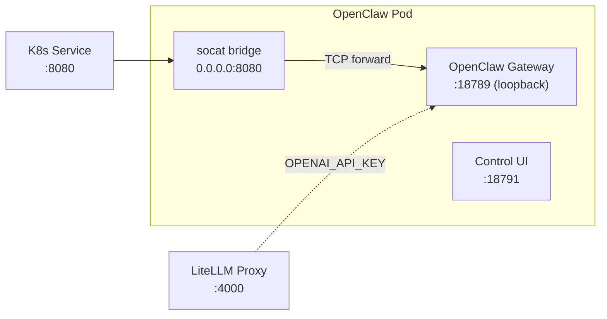

# NemoClaw OpenClaw Agent

> Back to [agent catalog](README.md) | [main doc](../openshell-integration.md)
>
> **Type:** NemoClaw
> **Framework:** OpenClaw (v2026.4.9)
> **LLM:** LiteMaaS (via LiteLLM proxy)
> **Supervisor:** No (standalone container)
> **Sandbox Model:** Tier 3 (K8s Deployment, no supervisor)
> **Status:** Deployed, all tests pass (9/9).

## 1. Overview

OpenClaw is the default agent from the [OpenClaw](https://openclaw.ai) platform,
integrated via [NVIDIA NemoClaw](https://github.com/NVIDIA/NemoClaw). It provides
a gateway-based AI assistant with a plugin ecosystem, workspace management, and
extension support.

In the Kagenti PoC, OpenClaw runs as a standalone K8s Deployment built from npm
(pinned to v2026.4.9). The gateway binds to 127.0.0.1:18789 internally; a socat
bridge exposes it on 0.0.0.0:8080 for K8s Service access.

## 2. Architecture



## 3. Files

```
deployments/openshell/agents/nemoclaw-openclaw/
├── Dockerfile         # Built from node:22-slim, installs openclaw from npm
│                      # (pinned v2026.4.9)
└── deployment.yaml    # Deployment + Service + AgentRuntime CR + ConfigMap
```

## 4. Deployment

```bash
# Kind
docker build -t nemoclaw-openclaw:latest deployments/openshell/agents/nemoclaw-openclaw/
kind load docker-image nemoclaw-openclaw:latest --name kagenti
kubectl apply -f deployments/openshell/agents/nemoclaw-openclaw/deployment.yaml
```

The fulltest script (`openshell-full-test.sh`) builds and deploys automatically.

## 5. Capabilities

| Capability | Supported | Notes |
|-----------|-----------|-------|
| A2A protocol | **No** | Gateway HTTP API (not A2A JSON-RPC) |
| Multi-turn context | Yes | Gateway session management |
| Tool calling | Yes | Extensions, plugins, workspace tools |
| Subagent delegation | Yes | Agent orchestration via extensions |
| Memory/knowledge | Yes | Disk-based memory, canvas, credentials |
| Skill execution | No | No A2A adapter yet |
| HITL approval | N/A | No supervisor |
| Plugin ecosystem | Yes | npm-based extension system |

## 6. Kagenti Integration

### 6.1 Communication Adapter

**HTTP gateway** — OpenClaw responds to HTTP on port 8080 (via socat bridge).
The gateway serves an HTML control UI and accepts WebSocket connections for
interactive sessions.

**TODO(a2a-adapter):** Wrap OpenClaw with an A2A JSON-RPC adapter to join the
standard agent test suite.

### 6.2 LLM Configuration

OpenClaw reads `OPENAI_API_KEY` and `OPENAI_API_BASE` environment variables.
The deployment points at the in-cluster LiteLLM proxy:

```yaml
env:
- name: OPENAI_API_BASE
  value: "http://litellm-model-proxy.team1.svc:4000/v1"
- name: OPENAI_API_KEY
  valueFrom:
    secretKeyRef:
      name: litellm-virtual-keys
      key: api-key
```

### 6.3 Known Limitations

| Limitation | Impact | Workaround |
|-----------|--------|------------|
| Gateway binds to 127.0.0.1 | K8s Service can't reach directly | socat bridge on 0.0.0.0:8080 |
| Requires `--allow-unconfigured` | Without config, gateway refuses to start | Passed in Dockerfile CMD |
| Node.js runtime | Larger image (~350MB) vs Python agents | Acceptable for PoC |

## 7. Policy Configuration

```yaml
# policy.yaml (ConfigMap)
version: 1
filesystem_policy:
  include_workdir: true
  read_only: [/usr, /lib, /etc, /app, /sandbox/.openclaw]
  read_write: [/sandbox/.openclaw-data, /sandbox/workspace, /tmp]
process:
  run_as_user: sandbox
  run_as_group: sandbox
network_policies:
  internal:
    endpoints:
      - host: "*.svc.cluster.local"
        port: 4000   # LiteLLM
      - host: "*.svc.cluster.local"
        port: 8080   # Other agents
```

## 8. Testing Status

| Test File | Tests | Pass | Skip | Notes |
|-----------|:---:|:---:|:---:|-------|
| test_11_nemoclaw_smoke (platform) | 3 | 3 | 0 | Deployment, pod running, framework label |
| test_11_nemoclaw_smoke (health) | 1 | 1 | 0 | HTTP gateway responds |
| test_11_nemoclaw_smoke (inference) | 1 | 1 | 0 | Gateway interaction verified |
| test_11_nemoclaw_smoke (security) | 4 | 4 | 0 | AuthBridge, capabilities, escalation, secret |
| **Total** | **9** | **9** | **0** | **100% pass rate** |

## 9. NemoClaw Source Pinning

| Component | Version | Source |
|-----------|---------|--------|
| NemoClaw | v0.0.28 | [NVIDIA/NemoClaw](https://github.com/NVIDIA/NemoClaw) |
| OpenClaw | v2026.4.9 | [npm: openclaw](https://www.npmjs.com/package/openclaw) |
| Base image | node:22-slim | SHA-pinned in Dockerfile |
