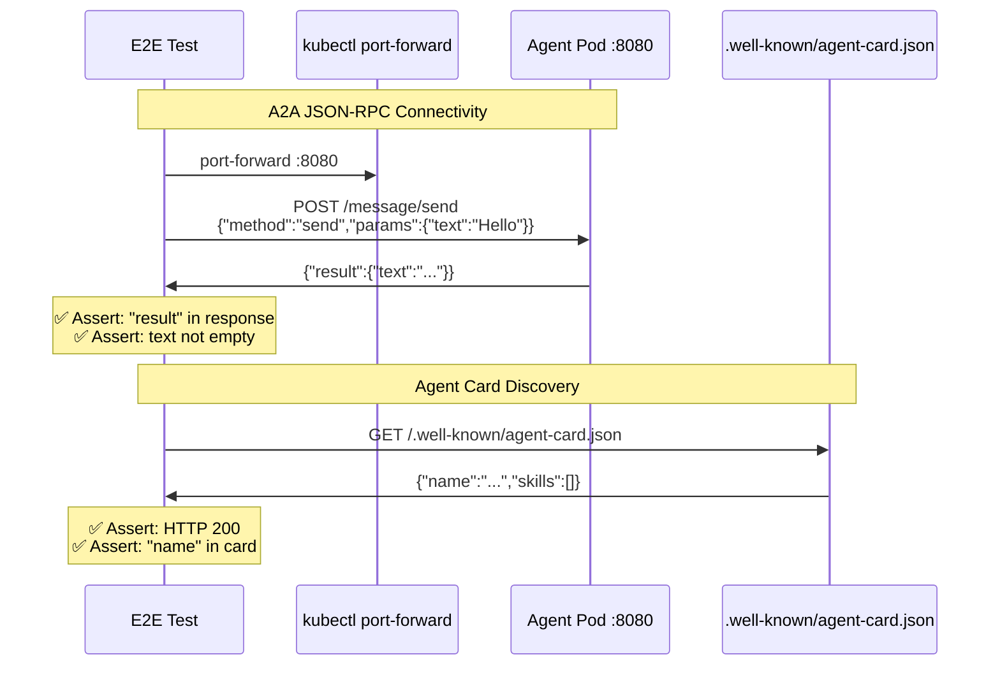

# A2A Connectivity

> **Test file:** `kagenti/tests/e2e/openshell/test_02_a2a_connectivity.py`
> **Tests:** 8 | **Pass:** 7 | **Skip:** 1 (Kind, fresh cluster)

## What This Tests

Validates that custom A2A agents respond to JSON-RPC message/send requests and expose agent cards at `.well-known/agent-card.json`. This is the foundation for agent-to-agent communication.

## Architecture Under Test

## Test Matrix

| Test | weather_agent | adk_agent | claude_sdk_agent | weather_supervised | os_claude | os_opencode | os_generic |
|------|--------------|-----------|-----------------|-------------------|----------|------------|-----------|
| A2A hello | ✅ | ✅ | ✅ | ✅ (kubectl exec) | — | — | — |
| Agent card | ✅ | ✅ | ✅ | ⏭️ netns DNS | — | — | — |

**Skip reasons:**
- **netns DNS** — Supervised agent uses network namespace; agent card test requires DNS resolution fix for cluster-local services
- **—** — Builtin sandboxes don't run A2A servers (they use kubectl exec, not HTTP)

## Test Details

### test_hello__weather_agent__a2a_response

- **What:** Weather agent responds to A2A message/send (no LLM needed)
- **Asserts:** "result" in response, text not empty
- **Debug points:** Response structure, text length
- **Agent coverage:** weather_agent

### test_hello__adk_agent__a2a_response

- **What:** ADK agent responds to A2A message/send (LLM optional for hello)
- **Asserts:** "result" in response
- **Debug points:** Response structure
- **Agent coverage:** adk_agent

### test_hello__claude_sdk_agent__a2a_response

- **What:** Claude SDK agent responds to A2A message/send (LLM optional)
- **Asserts:** "result" in response
- **Debug points:** Response structure
- **Agent coverage:** claude_sdk_agent

### test_hello__weather_supervised__kubectl_exec

- **What:** Supervised agent responds via kubectl exec (netns blocks port-forward)
- **Asserts:** exec returns 0, stdout contains "alive"
- **Debug points:** exec returncode, stderr
- **Agent coverage:** weather_supervised
- **Note:** Uses kubectl exec instead of A2A because supervisor's network namespace blocks port-forward

### test_agent_card__weather_agent__well_known

- **What:** Weather agent exposes agent card at .well-known endpoint
- **Asserts:** HTTP 200, "name" in card
- **Debug points:** HTTP status, card structure
- **Agent coverage:** weather_agent

### test_agent_card__adk_agent__well_known

- **What:** ADK agent exposes agent card at .well-known endpoint
- **Asserts:** HTTP 200, "name" or "agent" in card
- **Debug points:** HTTP status, card structure
- **Agent coverage:** adk_agent
- **Note:** Tries both `/agent.json` and `/agent-card.json` (ADK upstream variance)

### test_agent_card__claude_sdk_agent__well_known

- **What:** Claude SDK agent exposes agent card at .well-known endpoint
- **Asserts:** HTTP 200, "name" in card
- **Debug points:** HTTP status, card structure
- **Agent coverage:** claude_sdk_agent

### test_agent_card__weather_supervised__via_exec

- **What:** Supervised agent card accessible via kubectl exec (netns blocks port-forward)
- **Asserts:** "name" in card JSON (case-insensitive)
- **Debug points:** exec returncode, stderr, stdout
- **Agent coverage:** weather_supervised
- **Skip condition:** Deployment not ready OR exec fails OR DNS resolution fails in netns

## Port-Forward vs kubectl exec

Custom A2A agents are tested via two methods:

| Agent Type | Access Method | Why |
|------------|--------------|-----|
| `weather_agent`, `adk_agent`, `claude_sdk_agent` | `kubectl port-forward` | Direct access to pod port 8080 |
| `weather_supervised` | `kubectl exec` | Network namespace isolation blocks port-forward |

The supervised agent's network namespace means:
- All traffic routes through OPA proxy at 10.200.0.1:3128
- kubectl port-forward cannot reach the agent container directly
- Tests use `kubectl exec` to run commands inside the netns

## Future Expansion

| Agent Type | When Added | What's Needed |
|------------|-----------|---------------|
| `openshell_claude` | Phase 2 | ExecSandbox gRPC adapter for A2A simulation |
| `openshell_opencode` | Phase 2 | ExecSandbox gRPC adapter for A2A simulation |
| `openshell_generic` | N/A | No agent runtime (generic sandbox) |

## Common Failure Modes

| Symptom | Cause | Fix |
|---------|-------|-----|
| Connection refused | Port-forward not ready | Wait 5s after port-forward starts |
| Empty response | Agent not fully initialized | Add retry with backoff |
| 404 on agent card | Wrong endpoint path | Check ADK vs Claude SDK endpoint |
| exec timeout | Pod in netns deadlock | Check supervisor logs for OPA proxy |
