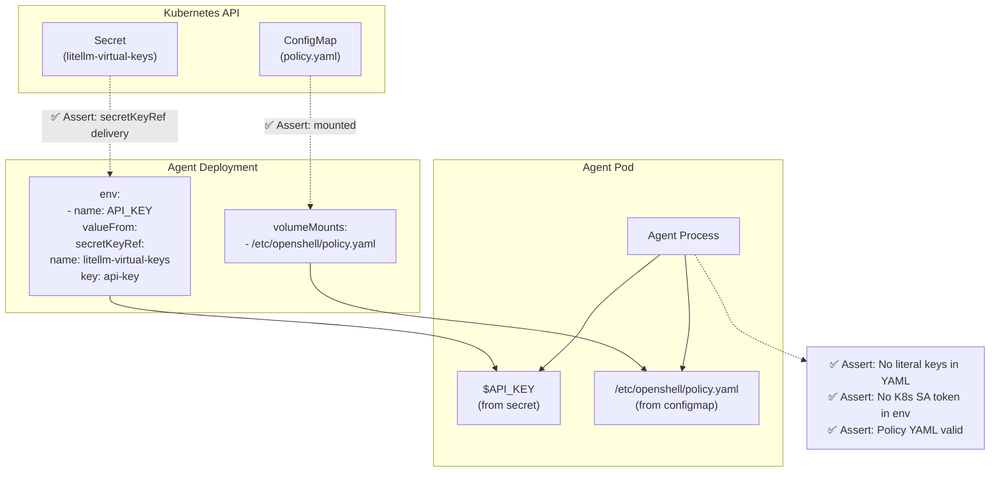

# Credential Security

> **Test file:** `kagenti/tests/e2e/openshell/test_T1_6_credential_security.py`
> **Tests:** 15 | **Pass:** 15 | **Skip:** 0 (Kind, fresh cluster)

## What This Tests

Validates that agent credentials are delivered securely via Kubernetes secretKeyRef (not hardcoded), policy ConfigMaps are properly mounted, and agent processes don't leak unnecessary secrets.

## Architecture Under Test

## Test Matrix

| Test | weather_agent | adk_agent | claude_sdk_agent | weather_supervised | os_claude | os_opencode | os_generic |
|------|--------------|-----------|-----------------|-------------------|----------|------------|-----------|
| API key from secretKeyRef | — | ✅ | ✅ | — | — | — | — |
| No hardcoded keys | ✅ | ✅ | ✅ | ✅ | — | — | — |
| No K8s token in env | ✅ | ✅ | ✅ | ✅ | — | — | — |
| Policy file exists | ✅ | ✅ | ✅ | ✅ | — | — | — |
| Policy valid YAML | ✅ | ✅ | ✅ | ✅ | — | — | — |

**Skip reasons:**
- **—** — Test not applicable (weather/supervised don't use LLM, builtins use gateway provider injection)

## Test Details

### test_api_key_from_secret_ref (parametrized: adk_agent, claude_sdk_agent)

- **What:** API key env var must come from a K8s Secret, not a literal value
- **Asserts:** 
  - `env[*].valueFrom.secretKeyRef` exists for API_KEY env vars
  - No `value:` field with literal key
- **Debug points:** Deployment YAML, env var names, valueFrom structure
- **Agent coverage:** adk_agent, claude_sdk_agent
- **Why only these:** weather_agent has no LLM, weather_supervised uses gateway provider injection

### test_no_literal_api_keys (parametrized: ALL 4 custom agents)

- **What:** Deployment YAML must not contain literal API key values
- **Asserts:** YAML doesn't contain patterns like "sk-", "api_key: sk", "key: ghp_"
- **Debug points:** Deployment YAML dump
- **Agent coverage:** weather_agent, adk_agent, claude_sdk_agent, weather_supervised

### test_no_kubernetes_token_exposed (parametrized: ALL 4 custom agents)

- **What:** Agent shouldn't have the K8s service account token in env
- **Asserts:** No `KUBERNETES_SERVICE_ACCOUNT_TOKEN=` in agent process env
- **Debug points:** `kubectl exec env` output
- **Agent coverage:** weather_agent, adk_agent, claude_sdk_agent, weather_supervised
- **Note:** SA token should be file-mounted only, not in env

### test_policy_file_exists (parametrized: ALL 4 custom agents)

- **What:** The OPA policy file should be mounted at /etc/openshell/
- **Asserts:** `ls /etc/openshell/` contains "policy.yaml"
- **Debug points:** ls output, exec stderr
- **Agent coverage:** weather_agent, adk_agent, claude_sdk_agent, weather_supervised

### test_policy_is_valid_yaml (parametrized: ALL 4 custom agents)

- **What:** The mounted policy file must be valid YAML with expected fields
- **Asserts:** 
  - `version:` field present
  - `filesystem_policy:` or `network_policies:` present
- **Debug points:** Policy file contents
- **Agent coverage:** weather_agent, adk_agent, claude_sdk_agent, weather_supervised

## Credential Delivery Models

| Agent Type | Credential Source | Delivery Method | Why |
|------------|------------------|----------------|-----|
| `weather_agent` | None | N/A | No LLM |
| `adk_agent` | LiteLLM virtual key | K8s Secret → secretKeyRef | Production credential isolation |
| `claude_sdk_agent` | LiteLLM virtual key | K8s Secret → secretKeyRef | Production credential isolation |
| `weather_supervised` | LiteLLM virtual key | Gateway provider injection | Supervisor intercepts all LLM calls |
| `openshell_claude` | Anthropic API key | Gateway provider injection | Phase 2 — builtin sandbox |
| `openshell_opencode` | OpenAI-compat key | Gateway provider injection | Phase 2 — builtin sandbox |
| `openshell_generic` | None | N/A | No agent runtime |

## Secret Key Names

| Secret | Namespace | Key Name | Used By |
|--------|-----------|----------|---------|
| `litellm-virtual-keys` | `team1` | `api-key` | adk_agent, claude_sdk_agent |
| `litellm-proxy-secret` | `kagenti-system` | `master-key` | LiteLLM proxy admin |

## Future Expansion

| Agent Type | When Added | What's Needed |
|------------|-----------|---------------|
| `openshell_claude` | Phase 2 | Test gateway provider injection mechanism |
| `openshell_opencode` | Phase 2 | Test gateway provider injection mechanism |
| Supervised agents with LLM | Phase 2 | Add secretKeyRef tests for supervisor → LLM credentials |

## Common Failure Modes

| Symptom | Cause | Fix |
|---------|-------|-----|
| API key not found | Wrong secret name | Verify `litellm-virtual-keys` exists |
| exec timeout | Pod not ready | Wait for pod to reach Running state |
| Policy not mounted | Wrong configmap name | Verify `{agent}-policy` configmap exists |
| Literal key in YAML | Hardcoded secret | Use secretKeyRef instead |
