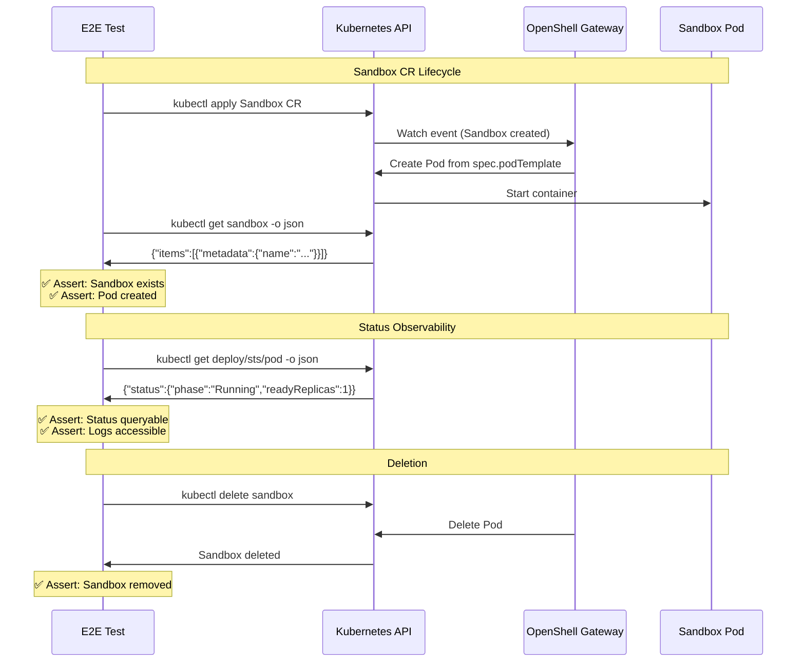

# Sandbox Lifecycle

> **Test file:** `kagenti/tests/e2e/openshell/test_04_sandbox_lifecycle.py`
> **Tests:** 7 | **Pass:** 7 | **Skip:** 0 (Kind, fresh cluster)

## What This Tests

Validates Sandbox CR (agents.x-k8s.io/v1alpha1) CRUD operations and status observability via Kubernetes API. This is the A2A-first equivalent of the OpenShell proposal's "openshell term shows sandbox status" requirement.

## Architecture Under Test



## Test Matrix

| Test | Sandbox CR | Gateway | Agent Deployments |
|------|-----------|---------|------------------|
| List sandboxes | ✅ | — | — |
| Create sandbox | ✅ | ✅ | — |
| Delete sandbox | ✅ | — | — |
| Gateway processes sandbox | — | ✅ | — |
| Gateway status queryable | — | ✅ | — |
| Agent deployments status queryable | — | — | ✅ |
| Agent pods status queryable | — | — | ✅ |
| Sandbox CR status queryable | ✅ | — | — |
| Gateway logs accessible | — | ✅ | — |

## Test Details

### test_list_sandboxes

- **What:** List Sandbox CRs — should succeed even if none exist
- **Asserts:** kubectl returncode == 0, "items" in JSON response
- **Debug points:** kubectl returncode, stderr
- **Agent coverage:** N/A (tests CRD availability)

### test_create_sandbox

- **What:** Create a Sandbox CR and verify the gateway picks it up
- **Asserts:** 
  - kubectl apply succeeds
  - Sandbox CR exists after creation
  - Sandbox name matches expected
- **Debug points:** kubectl returncode, stderr, sandbox name
- **Agent coverage:** N/A (tests gateway reactivity)
- **Cleanup:** Deletes sandbox after test

### test_delete_sandbox

- **What:** Create then delete a sandbox CR — self-contained
- **Asserts:** kubectl delete succeeds
- **Debug points:** kubectl returncode, stderr
- **Agent coverage:** N/A (tests CR deletion)
- **Cleanup:** Self-cleaning (deletes own sandbox)

### test_gateway_processes_sandbox

- **What:** Verify the gateway logs show it processed a sandbox event
- **Asserts:** Gateway logs contain "Listing sandboxes" or "sandbox"
- **Debug points:** Gateway log contents
- **Agent coverage:** Gateway (openshell-system namespace)

### test_gateway_status_queryable

- **What:** Gateway StatefulSet status is queryable with phase and readiness
- **Asserts:** readyReplicas >= spec.replicas
- **Debug points:** Gateway StatefulSet status
- **Agent coverage:** Gateway (openshell-system namespace)

### test_agent_deployments_status_queryable

- **What:** Each agent deployment exposes replicas, readyReplicas, conditions
- **Asserts:** 
  - Deployment status has replica counts OR conditions
  - (relaxed assertion to allow rollout-in-progress states)
- **Debug points:** Deployment name, status fields
- **Agent coverage:** ALL custom A2A agents (team1 namespace)

### test_agent_pods_status_queryable

- **What:** Each agent pod exposes phase, containerStatuses, and resource usage
- **Asserts:** 
  - Pod phase == "Running"
  - containerStatuses present
  - restartCount exists
- **Debug points:** Pod name, phase, container status
- **Agent coverage:** ALL custom A2A agents (team1 namespace)

### test_sandbox_cr_status_queryable

- **What:** Sandbox CRs expose status fields when created
- **Asserts:** 
  - kubectl get sandboxes succeeds
  - Response has "items" field
- **Debug points:** kubectl returncode, stderr
- **Agent coverage:** N/A (tests CRD schema)

### test_gateway_logs_accessible

- **What:** Gateway logs are accessible for debugging and audit
- **Asserts:** 
  - kubectl logs succeeds
  - Logs not empty
- **Debug points:** kubectl returncode, log length
- **Agent coverage:** Gateway (openshell-system namespace)

## Status Observability (vs OpenShell Proposal)

The OpenShell proposal requires:

> "openshell term shows sandbox status"

In Kagenti's A2A-first model, sandbox status is observed via:

| Proposal Requirement | Kagenti A2A Equivalent | How Tested |
|---------------------|----------------------|-----------|
| `openshell term` shows status | kubectl get pod/deploy/sandbox -o json | test_*_status_queryable |
| Terminal session active | Agent A2A endpoint responds | test_02_a2a_connectivity |
| Session reconnect | PVC-backed session restore | test_06_conversation_resume |

The Kagenti UI PodStatusPanel queries the same Kubernetes API these tests validate.

## Sandbox CR Schema

```yaml
apiVersion: agents.x-k8s.io/v1alpha1
kind: Sandbox
metadata:
  name: test-sandbox-poc
  namespace: team1
spec:
  podTemplate:  # Standard K8s PodSpec
    spec:
      containers:
      - name: sandbox
        image: ghcr.io/nvidia/openshell-community/sandboxes/base:latest
        command: ["sleep", "300"]
```

## Future Expansion

| Agent Type | When Added | What's Needed |
|------------|-----------|---------------|
| `openshell_claude` | Phase 2 | Test Claude Code sandbox image creation |
| `openshell_opencode` | Phase 2 | Test OpenCode sandbox image creation |
| Supervisor integration | Phase 2 | Test supervisor init container injection |

## Common Failure Modes

| Symptom | Cause | Fix |
|---------|-------|-----|
| Sandbox CRD not found | OpenShell not installed | Deploy OpenShell gateway + CRDs |
| Gateway not processing | Gateway pod not running | Check gateway StatefulSet status |
| Pod not created | Invalid podTemplate | Validate spec against K8s PodSpec schema |
| Logs empty | Gateway just started | Wait 10s for gateway initialization |
