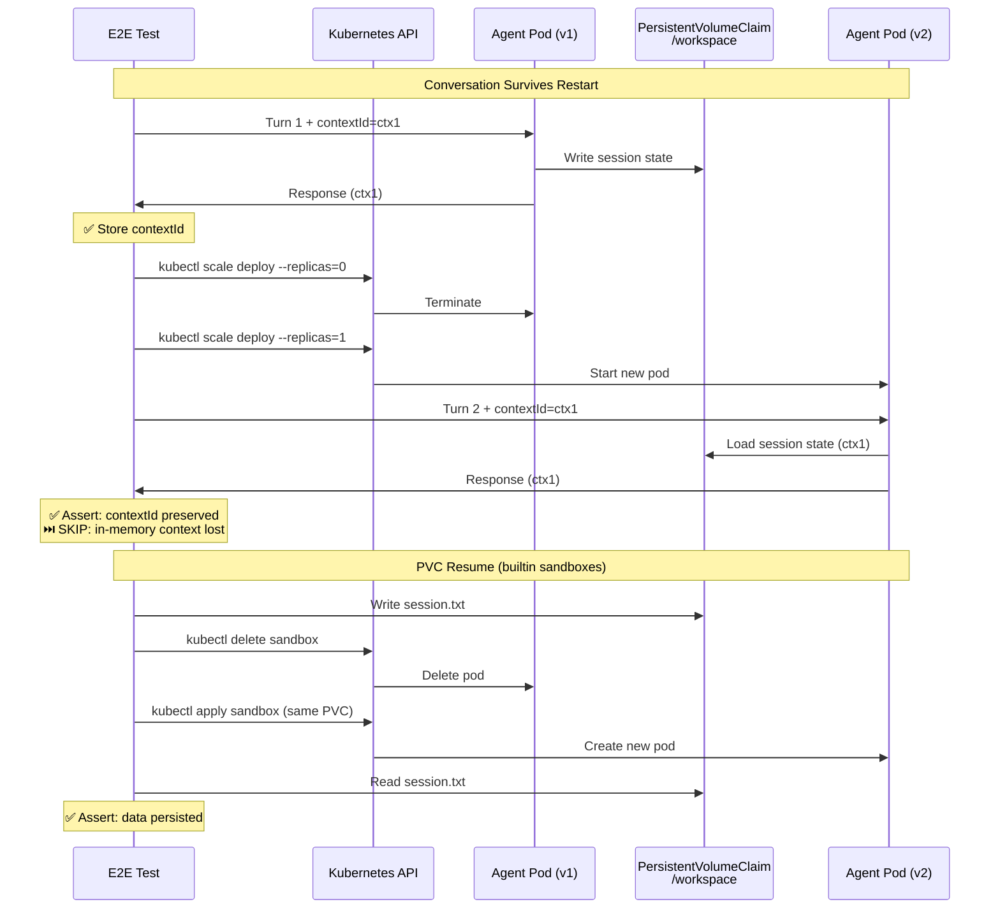
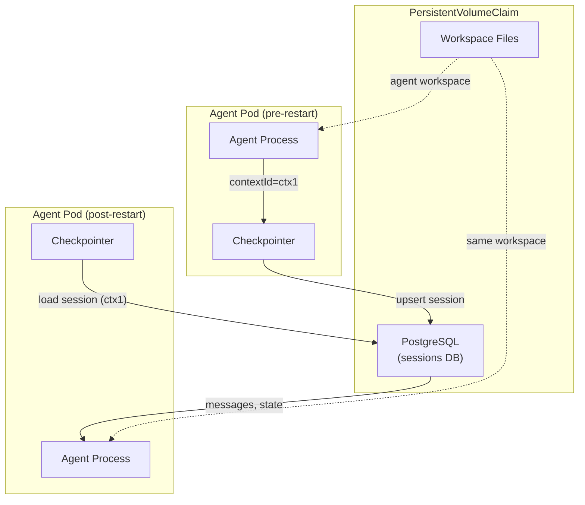

# Conversation Resume

> **Test file:** `kagenti/tests/e2e/openshell/test_06_conversation_resume.py`
> **Tests:** 5 | **Pass:** 0 | **Skip:** 5 (Kind, fresh cluster)

## What This Tests

Validates that conversation state survives pod restarts and PVC-backed session resume works correctly. This is the A2A equivalent of the OpenShell proposal's "session reconnect" requirement.

## Architecture Under Test



## Test Matrix

| Test | weather_agent | adk_agent | claude_sdk_agent | weather_supervised | os_generic |
|------|--------------|-----------|-----------------|-------------------|-----------|
| Restart: multiturn across restart | ⏭️ destructive | ⏭️ destructive | ⏭️ destructive | ⏭️ destructive | — |
| PVC resume: write/delete/recreate/read | — | — | — | — | ✅ |

**Skip reasons:**
- **destructive** — Test kills port-forward and scales deployment to 0; requires OPENSHELL_DESTRUCTIVE_TESTS=true
- **context lost** — Agents respond after restart but lose in-memory context (TODO: PVC-backed session store)
- **—** — Test not applicable for this agent type

## Test Details

### test_restart__agent__multiturn_across_restart (parametrized: 3 A2A agents)

- **What:** Turn 1 → scale 0 → scale 1 → Turn 2: does context survive?
- **Asserts:** 
  - Turn 1 succeeds and returns contextId
  - Agent restarts successfully
  - Turn 2 succeeds (with or without context preservation)
- **Debug points:** contextId values, restart timing, port-forward reconnect
- **Agent coverage:** weather_agent, adk_agent, claude_sdk_agent
- **Skip condition:** 
  - OPENSHELL_DESTRUCTIVE_TESTS != true (kills active port-forwards)
  - Agent is stateless (no contextId)
  - Agent returns but context lost (in-memory only)
  - TODO: PVC-backed session checkpoint + Kagenti backend restore

### test_restart__weather_supervised__kubectl_exec

- **What:** Supervised agent: restart test via kubectl exec
- **Asserts:** 
  - Scale 0 succeeds
  - Scale 1 succeeds
  - Pod ready after restart
- **Debug points:** Deployment readyReplicas, scale timing
- **Agent coverage:** weather_supervised
- **Skip condition:** 
  - OPENSHELL_DESTRUCTIVE_TESTS != true
  - A2A context test skipped (netns blocks port-forward)
  - TODO: ExecSandbox gRPC for session persistence testing

### test_resume__generic_sandbox__write_delete_recreate_read

- **What:** Generic sandbox: write to PVC, delete sandbox, recreate, verify data
- **Asserts:** 
  - PVC created
  - Sandbox pod writes data to /workspace/session.txt
  - Data readable in first pod
  - Sandbox deleted (pod terminated)
  - Sandbox recreated with same PVC
  - Data readable in second pod (after recreate)
- **Debug points:** PVC name, pod names, file contents, timing
- **Agent coverage:** openshell_generic (base sandbox image)
- **Skip condition:** 
  - OPENSHELL_DESTRUCTIVE_TESTS != true
  - Base image pull timeout (60s limit)

## Destructive Test Protection

These tests are destructive (kill pods, break port-forwards) and are disabled by default:

```bash
# Enable destructive tests
export OPENSHELL_DESTRUCTIVE_TESTS=true

# Run only conversation resume tests
uv run pytest kagenti/tests/e2e/openshell/test_06_conversation_resume.py -v
```

Why disabled by default:
- Kills active kubectl port-forward processes
- Disrupts other tests running in parallel
- Requires cluster cleanup between runs
- Long test duration (30-60s per test due to rollout waits)

## Current State vs Future State

| Capability | Current State | Future State | Blocker |
|------------|--------------|--------------|---------|
| A2A agents respond after restart | ✅ PASS | ✅ PASS | None |
| Context preserved after restart | ⏭️ SKIP (lost) | ✅ PASS | PVC-backed checkpointer + Kagenti backend |
| PVC data persists | ✅ PASS | ✅ PASS | None (works today for builtin sandboxes) |
| Supervised agent multi-turn | ⏭️ SKIP (netns) | ✅ PASS | ExecSandbox gRPC adapter |

## Session Store Architecture (Future)

When PVC-backed session store is implemented:



## PVC Cleanup Helper

Tests use a cleanup helper to prevent PVC leaks:

```python
def _cleanup_sandbox(name: str, pvc: str, ns: str = AGENT_NS):
    kubectl delete sandbox {name} -n {ns} --wait=false
    # Force delete any stuck pods
    for pod in matching_pods:
        kubectl delete pod {pod} --force --grace-period=0
    # Delete PVC (only after pods terminated)
    kubectl delete pvc {pvc} -n {ns} --wait=false
```

## Future Expansion

| Agent Type | When Added | What's Needed |
|------------|-----------|---------------|
| `openshell_claude` | Phase 2 | PVC `/workspace/.claude/` with session history |
| `openshell_opencode` | Phase 2 | PVC `/workspace/` with conversation logs |
| Custom A2A agents | Phase 2 | Kagenti backend session store (PostgreSQL + checkpointer) |
| Supervised agents | Phase 2 | ExecSandbox gRPC + backend session store |

## Common Failure Modes

| Symptom | Cause | Fix |
|---------|-------|-----|
| Port-forward killed | Destructive test side-effect | Rerun with OPENSHELL_DESTRUCTIVE_TESTS=false |
| PVC stuck in Terminating | Pod still bound | Force delete pod first, then PVC |
| Pod not recreated | Rollout timeout | Increase timeout to 150s |
| Context lost after restart | In-memory only | Implement PVC-backed checkpointer |
