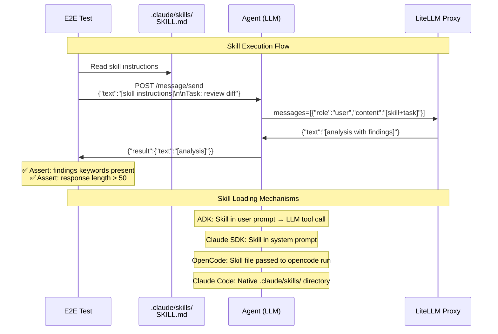

# Skill Execution

> **Test file:** `kagenti/tests/e2e/openshell/test_07_skill_execution.py`
> **Tests:** 27 | **Pass:** 18 | **Skip:** 9 (Kind, fresh cluster)

## What This Tests

Validates that agents can load and execute Kagenti skills (PR review, RCA, security review, code generation) using their respective skill loading mechanisms.

## Architecture Under Test



## Test Matrix

| Skill | weather_agent | adk_agent | claude_sdk_agent | weather_supervised | os_claude | os_opencode | os_generic |
|-------|--------------|-----------|-----------------|-------------------|----------|------------|-----------|
| **PR Review** | ⏭️ no LLM | ✅ | ✅ | ⏭️ no LLM | ⏭️ Anthropic key | ⏭️ /v1/responses | ⏭️ no agent |
| **RCA** | ⏭️ no LLM | ✅ | ✅ | ⏭️ no LLM | ⏭️ Anthropic key | ⏭️ /v1/responses | ⏭️ no agent |
| **Security Review** | ⏭️ no LLM | ✅ | ✅ | ⏭️ no LLM | ⏭️ Anthropic key | ⏭️ /v1/responses | ⏭️ no agent |
| **Code Generation** | — | — | ✅ | — | — | — | — |
| **Real GitHub PR** | — | ✅ | ✅ | — | ⏭️ Anthropic key | ⏭️ /v1/responses | — |
| **RCA CI Logs** | — | — | ✅ | — | — | — | — |
| **Skill Files Exist** | ✅ | ✅ | ✅ | ✅ | ✅ | ✅ | ✅ |

**Skip reasons:**
- **no LLM** — Agent has no LLM capability (by design)
- **no agent** — Generic sandbox has no agent CLI
- **Anthropic key** — Claude Code requires real Anthropic API key (Phase 2 provider integration)
- **/v1/responses** — OpenCode uses OpenAI Responses API which LiteLLM doesn't proxy yet
- **—** — Test not applicable for this agent type

## Test Details

### Skill Files Exist (ALL agents)

#### test_skill_files__all__key_skills_exist

- **What:** Key kagenti skills must exist in the repo
- **Asserts:** `github:pr-review`, `rca:ci`, `k8s:health`, `test:review` exist
- **Debug points:** Skills directory path, missing skills
- **Agent coverage:** ALL (repo-level check)

#### test_skill_structure__all__skill_md_present

- **What:** Each skill directory must contain a SKILL.md file
- **Asserts:** 4+ skill directories found, each has SKILL.md
- **Debug points:** Skill directory names
- **Agent coverage:** ALL (repo-level check)

### PR Review Skill

#### test_pr_review__claude_sdk_agent__follows_skill_instructions

- **What:** Claude SDK agent follows pr-review skill instructions
- **Asserts:** 
  - Response contains security-related keywords (sql, injection, os.system, command, security)
  - Response length > 50 chars
- **Debug points:** Response text, keywords found
- **Agent coverage:** claude_sdk_agent
- **Prompt:** Skill instructions (truncated 1000 chars) + CANONICAL_DIFF

#### test_pr_review__adk_agent__follows_skill_instructions

- **What:** ADK agent follows pr-review skill instructions
- **Asserts:** Response length > 30 chars
- **Debug points:** Response text
- **Agent coverage:** adk_agent
- **Prompt:** Skill instructions (truncated 800 chars) + CANONICAL_DIFF

#### test_pr_review__weather_agent__no_llm

- **What:** Weather agent cannot execute skills — no LLM
- **Asserts:** N/A (always skips)
- **Skip reason:** Pure tool-calling agent, no LLM

#### test_pr_review__weather_supervised__no_llm

- **What:** Supervised weather agent cannot execute skills — no LLM
- **Asserts:** N/A (always skips)
- **Skip reason:** Supervisor provides isolation, not LLM capabilities

#### test_pr_review__openshell_claude__native_skill_execution

- **What:** Claude Code builtin sandbox executes pr-review skill natively
- **Asserts:** N/A (always skips)
- **Skip reason:** Requires Anthropic API key (Phase 2 provider integration)
- **TODO:** Claude Code reads .claude/skills/ directly from workspace

#### test_pr_review__openshell_opencode__litemaas_provider

- **What:** OpenCode builtin sandbox executes pr-review skill via LiteMaaS
- **Asserts:** Response length > 20 chars
- **Skip reason:** LiteLLM /v1/responses API not available (OpenCode blocker)
- **Agent coverage:** openshell_opencode
- **How:** Creates sandbox, runs `opencode run -m openai/gpt-4o-mini` with skill+diff

#### test_pr_review__openshell_generic__no_agent

- **What:** Generic sandbox has no agent — cannot execute skills
- **Asserts:** N/A (always skips)
- **Skip reason:** No agent runtime in generic sandbox

### RCA Skill

#### test_rca__claude_sdk_agent__follows_skill_instructions

- **What:** Claude SDK agent follows rca:ci skill instructions
- **Asserts:** 
  - Response contains RCA keywords (secret, webhook, tls, mount, root cause, missing)
  - Response length > 50 chars
- **Debug points:** Response text, keywords found
- **Agent coverage:** claude_sdk_agent
- **Prompt:** Skill instructions + CANONICAL_CI_LOG

#### test_rca__adk_agent__follows_skill_instructions

- **What:** ADK agent follows rca:ci skill instructions
- **Asserts:** Response length > 30 chars
- **Agent coverage:** adk_agent
- **Prompt:** Skill instructions + CANONICAL_CI_LOG

#### test_rca__weather_agent__no_llm / test_rca__weather_supervised__no_llm

- **What:** Weather agents cannot execute RCA skill — no LLM
- **Skip reason:** Same as PR review (no LLM)

#### test_rca__openshell_claude__native_execution / test_rca__openshell_opencode__litemaas_provider

- **What:** Builtin sandboxes execute rca:ci skill
- **Skip reason:** Same as PR review (Anthropic key / OpenCode API blocker)

### Security Review Skill

#### test_security_review__claude_sdk_agent__follows_skill

- **What:** Claude SDK agent follows security review skill
- **Asserts:** 
  - Response mentions 2+ security issues (pickle, shell=true, injection, sql, command)
  - Response length > 50 chars
- **Debug points:** Response text, findings count
- **Agent coverage:** claude_sdk_agent
- **Prompt:** Skill instructions + CANONICAL_CODE (insecure Python)

#### test_security_review__adk_agent__follows_skill

- **What:** ADK agent follows security review skill
- **Asserts:** Response length > 30 chars
- **Agent coverage:** adk_agent

#### test_security_review__weather_agent__no_llm / test_security_review__weather_supervised__no_llm

- **Skip reason:** Same as PR review (no LLM)

#### test_security_review__openshell_claude__native / test_security_review__openshell_opencode__litemaas

- **Skip reason:** Same as PR review (Anthropic key / OpenCode API blocker)

### Code Generation Skill

#### test_code_generation__claude_sdk_agent__generates_code

- **What:** Claude SDK agent generates code from natural language spec
- **Asserts:** 
  - Response contains "def " or "fibonacci"
  - Response length > 30 chars
- **Debug points:** Response text
- **Agent coverage:** claude_sdk_agent
- **Prompt:** "Write a Python function called fibonacci(n) that returns the nth Fibonacci number using iteration. Include a docstring."

### Real-World Skill Execution

#### test_real_github_pr__claude_sdk_agent__fetches_and_reviews

- **What:** Fetch a real PR diff from kagenti repo and review it
- **Asserts:** Response length > 50 chars
- **Debug points:** GitHub API response, diff length
- **Agent coverage:** claude_sdk_agent
- **PR:** kagenti/kagenti#1300 (via GitHub API)
- **Skip condition:** Cannot fetch PR diff (HTTP != 200)

#### test_real_github_pr__adk_agent__fetches_and_reviews

- **What:** ADK agent reviews real GitHub PR
- **Asserts:** Response length > 30 chars
- **Agent coverage:** adk_agent
- **PR:** kagenti/kagenti#1300

#### test_rca_ci_logs__claude_sdk_agent__identifies_root_cause

- **What:** Send CI-style error logs and ask agent for root cause analysis
- **Asserts:** Response contains RCA keywords (secret, webhook, tls, mount, not found, root cause)
- **Agent coverage:** claude_sdk_agent
- **Prompt:** CANONICAL_CI_LOG

#### test_real_github_pr__openshell_claude__native_clone_and_review

- **What:** Claude Code sandbox reviews real PR natively
- **Skip reason:** Requires Anthropic API key + workspace PVC with repo clone (Phase 2)
- **TODO:** Highest-value skill test (native .claude/skills/ execution)

#### test_real_github_pr__openshell_opencode__litemaas_review

- **What:** OpenCode sandbox reviews real PR diff via LiteMaaS
- **Skip reason:** LiteLLM /v1/responses API blocker

### Builtin Sandbox CLIs

#### test_builtin_cli__openshell_claude__claude_binary_present

- **What:** Claude Code sandbox must have `claude` binary
- **Skip reason:** TODO — Create sandbox + kubectl exec -- which claude

#### test_builtin_cli__openshell_opencode__opencode_binary_present

- **What:** OpenCode sandbox must have `opencode` binary
- **Skip reason:** TODO — Create sandbox + kubectl exec -- which opencode

#### test_builtin_cli__openshell_generic__has_bash_and_tools

- **What:** Generic sandbox must have bash, git, curl
- **Skip reason:** TODO — Create sandbox + kubectl exec -- bash -c 'which git curl'

## Canonical Test Data

Tests use three canonical inputs:

### CANONICAL_DIFF (PR review)

```diff
+    query = f"SELECT * FROM users WHERE id={user_id}"
+    os.system(f"rm -rf {path}")
```

**Expected findings:** SQL injection, shell command injection

### CANONICAL_CI_LOG (RCA)

```
Error: Secret 'webhook-tls-cert' not found
Failed to mount volume at /etc/tls/
```

**Expected findings:** Missing secret, mount failure

### CANONICAL_CODE (Security review)

```python
import pickle
subprocess.run(cmd, shell=True)
query = f"SELECT * FROM users WHERE id={user_input}"
```

**Expected findings:** pickle deserialization, shell=True, SQL injection

## Skill Loading Mechanisms

| Agent Type | Mechanism | Example |
|------------|-----------|---------|
| `adk_agent` | Skill in user prompt | LLM follows instructions via tool calling |
| `claude_sdk_agent` | Skill in system prompt | Skill injected before user message |
| `openshell_claude` | Native `.claude/skills/` | Claude Code reads skill directory |
| `openshell_opencode` | Skill file passed to CLI | `opencode run --skill github:pr-review` |

## Future Expansion

| Agent Type | When Added | What's Needed |
|------------|-----------|---------------|
| `openshell_claude` | Phase 2 | Anthropic API key via gateway provider injection |
| `openshell_opencode` | Phase 2 | LiteLLM /v1/responses API support OR OpenCode flag change |
| `weather_supervised` | N/A | No LLM (supervisor provides isolation only) |
| ADK upstream | Upstream PR | Skill discovery from .claude/skills/ directory |

## Common Failure Modes

| Symptom | Cause | Fix |
|---------|-------|-----|
| Response too short | LLM timeout or empty response | Increase timeout to 120s |
| Keywords not found | LLM didn't follow skill | Verify skill instructions in prompt |
| OpenCode sandbox timeout | Image pull delay | Increase deadline to 60s |
| GitHub API 403 | Rate limit | Set GITHUB_TOKEN env var |
