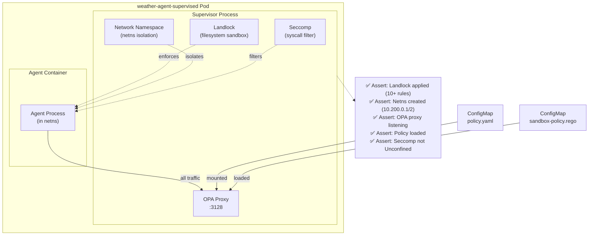

# Supervisor Enforcement

> **Test file:** `kagenti/tests/e2e/openshell/test_08_supervisor_enforcement.py`
> **Tests:** 11 | **Pass:** 11 | **Skip:** 0 (Kind, fresh cluster)

## What This Tests

Validates that the supervisor ACTUALLY enforces isolation via Landlock (filesystem), network namespace (egress isolation), OPA policy loading, and seccomp filters. Tests verify enforcement by checking supervisor logs for applied rules.

## Architecture Under Test



## Test Matrix

| Test | weather_supervised | Other Agents |
|------|-------------------|--------------|
| Landlock applied in logs | ✅ | — |
| Landlock ABI version v2+ | ✅ | — |
| Read-only paths configured | ✅ | — |
| Read-write paths configured | ✅ | — |
| Netns created in logs | ✅ | — |
| OPA proxy listening | ✅ | — |
| Netns name in logs | ✅ | — |
| Seccomp not Unconfined | ✅ | — |
| OPA policy loaded | ✅ | — |
| Policy has network rules | ✅ | — |
| Rego file mounted | ✅ | — |
| TLS termination enabled | ✅ | — |

**Note:** Only `weather_supervised` is tested because it's the only agent deployed with the supervisor.

## Test Details

### Landlock Enforcement

#### test_landlock_applied_in_logs

- **What:** Supervisor logs must show Landlock was applied with rules
- **Asserts:** 
  - "CONFIG:APPLYING" in logs
  - "Landlock filesystem sandbox" in logs
  - "rules_applied:" in logs
  - rules_applied count >= 10
- **Debug points:** Supervisor logs, rules count
- **Agent coverage:** weather_supervised

#### test_landlock_abi_version

- **What:** Supervisor must use Landlock ABI V2 or higher
- **Asserts:** 
  - "abi:" in logs (case-insensitive)
  - Parsed ABI version >= 2
- **Debug points:** ABI version string
- **Agent coverage:** weather_supervised
- **Why v2+:** Landlock v1 has limited syscall coverage; v2+ adds network and IPC isolation

#### test_read_only_paths_configured

- **What:** Policy must define read-only paths
- **Asserts:** 
  - ConfigMap contains "read_only:"
  - Policy includes "/usr" and "/etc"
- **Debug points:** ConfigMap contents
- **Agent coverage:** weather_supervised

#### test_read_write_paths_configured

- **What:** Policy must define read-write paths (tmp, app)
- **Asserts:** 
  - Policy includes "/tmp"
  - Policy includes "/app"
- **Debug points:** ConfigMap contents
- **Agent coverage:** weather_supervised

### Network Namespace Enforcement

#### test_netns_created_in_logs

- **What:** Supervisor logs must show network namespace was created
- **Asserts:** 
  - "CONFIG:CREATING" in logs
  - "Network namespace" in logs
  - "10.200.0.1" in logs (host veth IP)
  - "10.200.0.2" in logs (sandbox veth IP)
- **Debug points:** Supervisor logs, veth IPs
- **Agent coverage:** weather_supervised

#### test_opa_proxy_listening

- **What:** OPA proxy must be listening on 10.200.0.1:3128
- **Asserts:** 
  - "NET:LISTEN" in logs
  - "10.200.0.1:3128" in logs
- **Debug points:** Supervisor logs
- **Agent coverage:** weather_supervised

#### test_netns_name_in_logs

- **What:** Network namespace must have a unique name
- **Asserts:** 
  - Logs contain "ns:sandbox-{hex_id}"
  - hex_id length >= 6 chars
- **Debug points:** Netns name
- **Agent coverage:** weather_supervised

### Seccomp Enforcement

#### test_seccomp_not_explicitly_disabled

- **What:** Pod spec must not have seccomp set to Unconfined
- **Asserts:** 
  - For each container: securityContext.seccompProfile.type != "Unconfined"
- **Debug points:** Deployment JSON, container names, seccomp type
- **Agent coverage:** weather_supervised
- **Note:** Tests K8s deployment, not supervisor logs (seccomp applied by kubelet)

### OPA Policy Enforcement

#### test_opa_policy_loaded

- **What:** Supervisor logs must show OPA policy was loaded
- **Asserts:** 
  - "CONFIG:LOADING" in logs
  - "OPA policy engine" in logs
  - "sandbox-policy.rego" in logs
- **Debug points:** Supervisor logs
- **Agent coverage:** weather_supervised

#### test_policy_has_network_rules

- **What:** OPA policy data must define network endpoint rules
- **Asserts:** 
  - ConfigMap contains "network_policies:"
  - ConfigMap contains "endpoints:"
- **Debug points:** ConfigMap contents
- **Agent coverage:** weather_supervised

#### test_rego_file_mounted

- **What:** The OPA Rego rules file must be mounted in the pod
- **Asserts:** kubectl exec ls /etc/openshell/sandbox-policy.rego succeeds
- **Debug points:** exec returncode, stderr
- **Agent coverage:** weather_supervised

#### test_tls_termination_enabled

- **What:** Supervisor must enable TLS termination for L7 inspection
- **Asserts:** 
  - "TLS termination enabled" in logs
  - "ephemeral CA generated" in logs
- **Debug points:** Supervisor logs
- **Agent coverage:** weather_supervised
- **Why:** OPA must decrypt HTTPS to inspect URLs for policy enforcement

## Supervisor Log Markers

Tests look for structured log markers:

| Marker | Phase | Example |
|--------|-------|---------|
| `CONFIG:APPLYING` | Landlock setup | "CONFIG:APPLYING Landlock filesystem sandbox with rules_applied:12 abi:v2" |
| `CONFIG:CREATING` | Netns setup | "CONFIG:CREATING Network namespace ns:sandbox-a3f7c9 with veth 10.200.0.1<->10.200.0.2" |
| `CONFIG:LOADING` | OPA setup | "CONFIG:LOADING OPA policy engine from /etc/openshell/sandbox-policy.rego" |
| `NET:LISTEN` | Proxy start | "NET:LISTEN OPA proxy listening on 10.200.0.1:3128" |

## Policy ConfigMap Structure

```yaml
apiVersion: v1
kind: ConfigMap
metadata:
  name: weather-agent-supervised-policy
data:
  policy.yaml: |
    version: 1
    filesystem_policy:
      read_only:
        - /usr
        - /etc
      read_write:
        - /tmp
        - /app
    network_policies:
      endpoints:
        - url: "*.svc.cluster.local"
          allow: true
        - url: "litellm-proxy.kagenti-system.svc"
          allow: true
  sandbox-policy.rego: |
    package openshell.sandbox
    default allow = false
    allow { ... }
```

## Enforcement vs Observability

| Test Type | What's Tested | Limitation |
|-----------|--------------|------------|
| Log-based (this test) | Supervisor applied rules | Cannot verify LIVE enforcement (kubectl exec bypasses Landlock) |
| Exec-based (test_09_hitl_policy) | OPA blocks unauthorized egress | Live enforcement via network calls |

**Why log-based?** kubectl exec runs as root in the pod namespace, bypassing Landlock and seccomp. To test live enforcement, we need the agent process itself to attempt violations — which test_09_hitl_policy does via OPA proxy.

## Future Expansion

| Agent Type | When Added | What's Needed |
|------------|-----------|---------------|
| `openshell_claude` | Phase 2 | Supervisor injection for builtin sandboxes |
| `openshell_opencode` | Phase 2 | Supervisor injection for builtin sandboxes |
| Live Landlock tests | Phase 2 | Agent process attempts to write to /usr (should fail) |
| Live seccomp tests | Phase 2 | Agent process attempts blocked syscall (should fail) |

## Common Failure Modes

| Symptom | Cause | Fix |
|---------|-------|-----|
| "CONFIG:APPLYING" not in logs | Supervisor crashed during init | Check supervisor container logs for panic |
| ABI version 0 | Kernel doesn't support Landlock | Requires Linux 5.13+ with CONFIG_SECURITY_LANDLOCK=y |
| Netns IP not found | Netns creation failed | Check supervisor privileges (CAP_NET_ADMIN) |
| OPA proxy not listening | OPA binary missing | Verify supervisor image includes OPA |
| Policy file not mounted | ConfigMap name mismatch | Verify `{agent}-policy` configmap exists |
