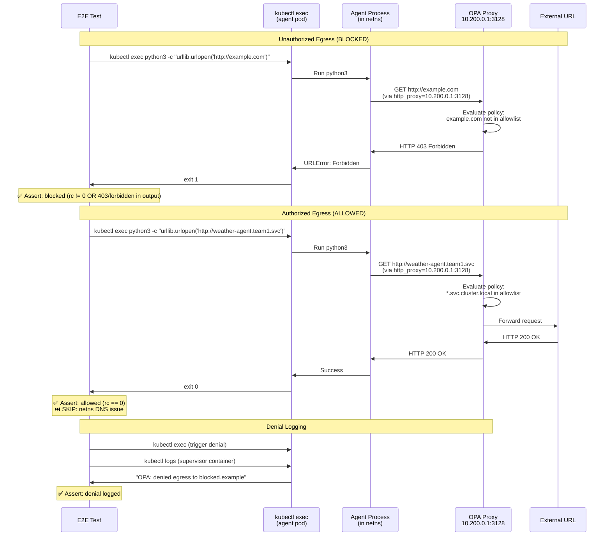

# HITL Policy

> **Test file:** `kagenti/tests/e2e/openshell/test_09_hitl_policy.py`
> **Tests:** 3 | **Pass:** 2 | **Skip:** 1 (Kind, fresh cluster)

## What This Tests

Validates that OPA policy enforcement ACTUALLY blocks unauthorized egress and allows authorized egress. This is the live enforcement complement to test_08 (which verifies rules are applied via logs).

## Architecture Under Test



## Test Matrix

| Test | weather_supervised | Other Agents |
|------|-------------------|--------------|
| OPA denies unauthorized egress | ✅ | — |
| OPA allows authorized egress | ⏭️ netns DNS | — |
| Denial logged with details | ⏭️ log stream | — |

**Skip reasons:**
- **netns DNS** — Supervisor netns may not resolve cluster-local DNS, causing OPA to treat internal service as unauthorized
- **log stream** — OPA may log to different stream (TODO: verify logging configuration)
- **—** — Only supervised agent has OPA proxy

## Test Details

### test_hitl__opa_denies_unauthorized_egress

- **What:** OPA proxy must block access to unauthorized domain (e.g., example.com)
- **Asserts:** 
  - kubectl exec returns non-zero OR
  - Output contains 403/forbidden/denied/refused/error/urlopen
- **Debug points:** exec returncode, stdout, stderr
- **Agent coverage:** weather_supervised
- **How:** 
  - Uses python3 urllib (curl not in all agent images)
  - Sets http_proxy=10.200.0.1:3128
  - Attempts to fetch http://example.com
- **Why blocked:** example.com not in policy allowlist

### test_hitl__opa_allows_authorized_egress

- **What:** OPA proxy must allow access to authorized domain (policy allowlist)
- **Asserts:** 
  - kubectl exec returns 0 (success) OR
  - Output contains status code (not error)
- **Debug points:** exec returncode, stdout, stderr
- **Agent coverage:** weather_supervised
- **Skip condition:** 
  - OPA denies internal service (403/forbidden in output)
  - Connection fails (urlopen error)
  - TODO: Verify netns DNS configuration resolves *.svc.cluster.local
- **How:** 
  - Attempts to fetch http://weather-agent.team1.svc.cluster.local:8080/.well-known/agent-card.json
  - This is an internal cluster service (should be allowed)
- **Why allowed:** Policy allows *.svc.cluster.local

### test_hitl__denial_logged_with_details

- **What:** OPA denials must be logged in supervisor logs with policy details
- **Asserts:** 
  - Supervisor logs contain OPA-related keywords (opa:, policy:, denied, blocked, egress)
- **Debug points:** Supervisor logs (last 100 lines)
- **Agent coverage:** weather_supervised
- **Skip condition:** 
  - OPA denial not logged (supervisor may log to different stream)
  - TODO: Verify OPA logging configuration
- **How:** 
  - Triggers a denial (fetch http://blocked.example)
  - Reads supervisor container logs
  - Looks for denial markers

## Policy Allowlist (weather_supervised)

```yaml
network_policies:
  endpoints:
    - url: "*.svc.cluster.local"
      allow: true
      reason: "Internal cluster services"
    
    - url: "litellm-proxy.kagenti-system.svc:4000"
      allow: true
      reason: "LLM provider"
    
    - url: "*"
      allow: false
      reason: "Default deny external egress"
```

## Why python3 urllib (not curl)?

- **curl** not included in all agent base images
- **python3** included in all LLM-capable agent images
- **urllib** part of Python stdlib (no pip install needed)
- **Proxy support** via os.environ['http_proxy']

## Live Enforcement vs Log Verification

| Test File | What's Tested | How |
|-----------|--------------|-----|
| test_08_supervisor_enforcement | Rules APPLIED | Supervisor logs show "CONFIG:APPLYING" |
| test_09_hitl_policy | Rules ENFORCED | Agent process blocked/allowed by OPA |

Both are needed:
- test_08 verifies supervisor started correctly
- test_09 verifies supervisor actually blocks traffic

## Netns DNS Issue

The supervised agent runs in an isolated network namespace. Current issue:

| Component | IP | DNS Resolution |
|-----------|----|----|
| Host network | DHCP | Resolves *.svc.cluster.local via CoreDNS |
| Supervisor netns | 10.200.0.1 (host), 10.200.0.2 (sandbox) | May not resolve cluster DNS |

**Symptom:** `weather-agent.team1.svc.cluster.local` → DNS lookup failed

**Workaround:** Test with IP instead of FQDN OR configure netns to use cluster DNS

**TODO:** Fix netns DNS configuration in supervisor to inherit CoreDNS from host

## OPA Logging Issue

The test expects OPA denials in supervisor logs but they may be logged elsewhere:

| Log Destination | How to Check |
|----------------|--------------|
| Supervisor stdout | `kubectl logs deploy/weather-agent-supervised -c agent` |
| OPA sidecar | `kubectl logs deploy/weather-agent-supervised -c opa` (if separate container) |
| External log collector | Fluent Bit / OpenTelemetry logs |

**TODO:** Verify where OPA logs denials and update test assertion

## Future Expansion

| Agent Type | When Added | What's Needed |
|------------|-----------|---------------|
| `openshell_claude` | Phase 2 | Supervisor injection for builtin sandboxes |
| `openshell_opencode` | Phase 2 | Supervisor injection for builtin sandboxes |
| Real-world allowlist | Phase 2 | Test with actual LLM provider URLs (api.anthropic.com, api.openai.com) |
| HITL approval flow | Phase 3 | Test human-in-the-loop approval for denied egress |

## Common Failure Modes

| Symptom | Cause | Fix |
|---------|-------|-----|
| Both allowed and blocked succeed | OPA proxy not running | Check supervisor logs for "NET:LISTEN" |
| Both allowed and blocked fail | Netns routing broken | Check veth pair 10.200.0.1<->10.200.0.2 |
| Allowed URL blocked | DNS resolution failure in netns | Use IP or fix netns DNS |
| Denial not logged | OPA logs to different stream | Check all pod containers for logs |
| URLError timeout | OPA proxy deadlock | Restart supervisor pod |
