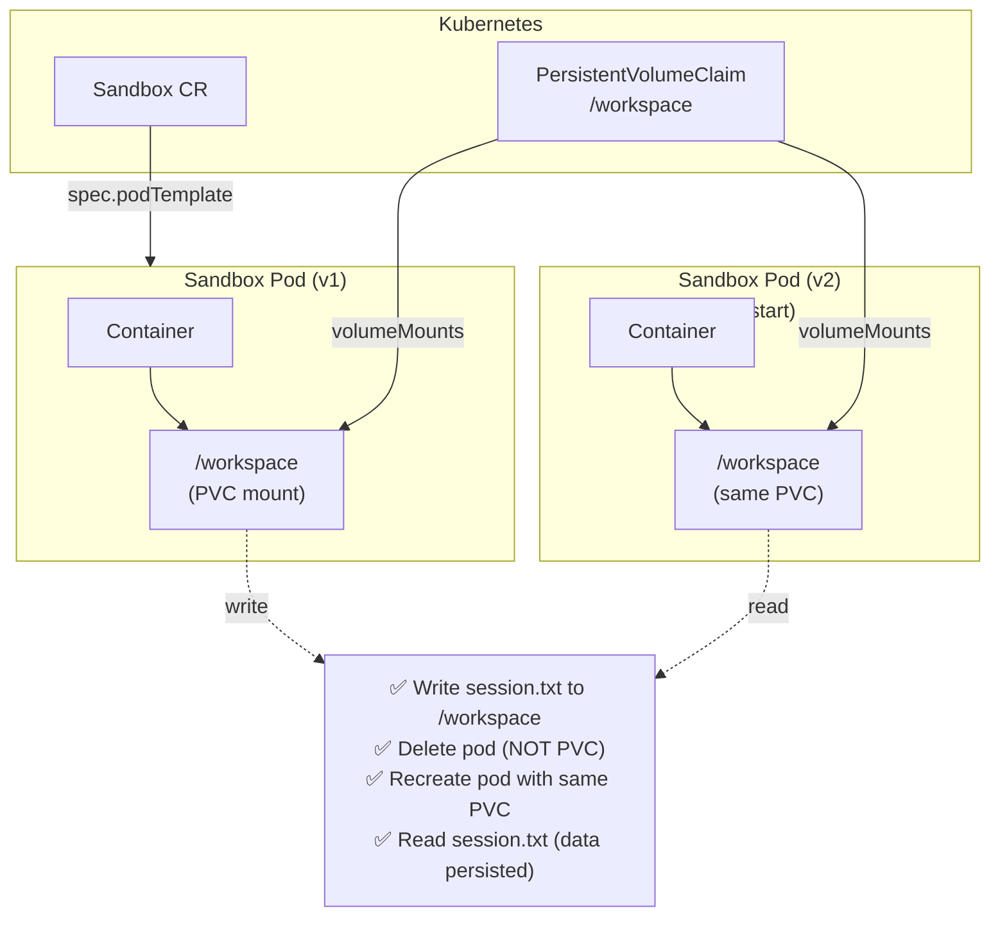

# Workspace Persistence

> **Test file:** `kagenti/tests/e2e/openshell/test_10_workspace_persistence.py`
> **Tests:** 8 | **Pass:** 7 | **Skip:** 1 (Kind, fresh cluster)

## What This Tests

Validates that PVC-backed workspace state persists across sandbox pod restarts and that builtin sandbox CRs can be created successfully with workspace volumes.

## Architecture Under Test



## Test Matrix

| Test | os_generic | os_claude | os_opencode | Custom A2A Agents |
|------|-----------|----------|------------|------------------|
| PVC persistence: session written to PVC | ✅ | ✅ | ✅ | — |
| PVC survives sandbox deletion | ✅ | — | — | — |
| Sandbox creation: generic | ✅ | — | — | — |
| Sandbox creation: Claude | — | ✅ | — | — |
| Sandbox creation: OpenCode | — | — | ✅ | — |
| Workspace read after pod delete | ✅ | — | — | — |

**Note:** Custom A2A agents don't use Sandbox CRs (they're deployed as Deployments).

## Test Details

### PVC Workspace Persistence (ALL builtin sandboxes)

#### test_pvc_persistence__sandbox__session_written_to_pvc (parametrized: 3 sandbox types)

- **What:** Create sandbox with PVC, write session data, verify data persisted
- **Asserts:** 
  - PVC created
  - Sandbox CR created
  - Pod reaches Running state (within 60s)
  - kubectl exec cat {path} contains expected content
- **Debug points:** PVC name, pod name, file path, contents
- **Agent coverage:** os_generic, os_claude, os_opencode
- **Skip condition:** Base image pull timeout (60s limit)
- **Cleanup:** Deletes sandbox + PVC after test

**Parametrized test data:**

| Sandbox Type | Content | Path | Command |
|-------------|---------|------|---------|
| `test-pvc-generic` | `session-generic` | `/workspace/session.txt` | `echo '{content}' > {path} && sleep 300` |
| `test-pvc-claude` | `claude-workspace` | `/workspace/.claude/context.json` | `mkdir -p /workspace/.claude && echo '{content}' > {path} && sleep 300` |
| `test-pvc-opencode` | `opencode-session` | `/workspace/.opencode/state.json` | `mkdir -p /workspace/.opencode && echo '{content}' > {path} && sleep 300` |

#### test_pvc_persistence__all__pvc_survives_sandbox_deletion

- **What:** PVC persists after Sandbox CR deleted — enables session resume
- **Asserts:** 
  - PVC created
  - Sandbox created
  - Sandbox deleted
  - PVC still exists (kubectl get pvc succeeds)
- **Debug points:** PVC name, sandbox name
- **Agent coverage:** ALL builtin sandboxes
- **Cleanup:** Deletes sandbox + PVC after test

### Builtin Sandbox Creation

#### test_sandbox_creation__generic__creates_and_runs

- **What:** Generic sandbox creates successfully and pod reaches Running state
- **Asserts:** 
  - Sandbox CR created (kubectl apply succeeds)
  - Pod reaches Running phase (within 60s)
- **Debug points:** Sandbox name, pod name, phase
- **Agent coverage:** os_generic
- **Skip condition:** Base image pull timeout
- **Cleanup:** Deletes sandbox after test

#### test_sandbox_creation__claude__creates_with_workspace

- **What:** Claude Code sandbox CR is accepted with PVC workspace mount
- **Asserts:** 
  - PVC created
  - Sandbox CR created
  - Sandbox CR exists after creation
- **Debug points:** Sandbox name, PVC name
- **Agent coverage:** os_claude
- **Cleanup:** Deletes sandbox + PVC after test

#### test_sandbox_creation__opencode__creates_with_workspace

- **What:** OpenCode sandbox CR is accepted with PVC workspace mount
- **Asserts:** 
  - PVC created
  - Sandbox CR created
  - Sandbox CR exists after creation
- **Debug points:** Sandbox name, PVC name
- **Agent coverage:** os_opencode
- **Cleanup:** Deletes sandbox + PVC after test

### Workspace Read After Restart

#### test_workspace_read__generic__data_persists_after_pod_delete

- **What:** Write to PVC, delete pod, wait for recreate, verify data readable
- **Asserts:** 
  - PVC created
  - Sandbox created and pod running
  - Data written to /workspace/restart-test.txt
  - Data readable in first pod
  - First pod deleted (kubectl delete pod --force)
  - Second pod created by controller
  - Data readable in second pod (same PVC)
- **Debug points:** PVC name, pod1 name, pod2 name, file contents
- **Agent coverage:** os_generic
- **Note:** Deletes POD (not Sandbox CR) so controller recreates it

## Sandbox CR Schema (with PVC)

```yaml
apiVersion: agents.x-k8s.io/v1alpha1
kind: Sandbox
metadata:
  name: test-pvc-claude
  namespace: team1
spec:
  podTemplate:
    spec:
      containers:
      - name: sandbox
        image: ghcr.io/nvidia/openshell-community/sandboxes/base:latest
        command: ["sh", "-c", "mkdir -p /workspace/.claude && echo 'session' > /workspace/.claude/context.json && sleep 300"]
        volumeMounts:
        - name: workspace
          mountPath: /workspace
      volumes:
      - name: workspace
        persistentVolumeClaim:
          claimName: test-pvc-claude-pvc
```

## Cleanup Helper

Tests use a cleanup helper to prevent resource leaks:

```python
def _cleanup_sandbox(name: str, pvc: str, ns: str = AGENT_NS):
    # Delete Sandbox CR (non-blocking)
    kubectl delete sandbox {name} -n {ns} --wait=false
    
    # Force delete any stuck pods
    for pod in matching_pods:
        kubectl delete pod {pod} --force --grace-period=0
    
    # Wait for pods to terminate
    time.sleep(3)
    
    # Delete PVC (only after pods terminated)
    kubectl delete pvc {pvc} -n {ns} --wait=false
```

**Why force delete?** Sandbox pods may be in CrashLoopBackOff or stuck in Terminating state, blocking PVC deletion.

## PVC Access Modes

| Mode | Description | Used By |
|------|-------------|---------|
| `ReadWriteOnce` | Single node, single writer | All tests (Kind is single-node) |
| `ReadWriteMany` | Multi-node, multiple writers | Future: shared workspace across pods |
| `ReadOnlyMany` | Multi-node, read-only | Future: skill library volumes |

## Workspace Directory Structure

| Sandbox Type | Workspace Root | Session Files | Config Files |
|-------------|---------------|---------------|--------------|
| `os_generic` | `/workspace/` | `session.txt` | — |
| `os_claude` | `/workspace/` | `.claude/context.json`, `.claude/memory/` | `.claude/settings.json` |
| `os_opencode` | `/workspace/` | `.opencode/state.json` | `.opencode/config.json` |

## Parametrized Test Data

```python
ALL_SANDBOX_TYPES = [
    pytest.param(
        "test-pvc-generic",
        "session-generic",
        "/workspace/session.txt",
        "echo 'session-generic' > /workspace/session.txt && sleep 300",
        id="generic",
    ),
    pytest.param(
        "test-pvc-claude",
        "claude-workspace",
        "/workspace/.claude/context.json",
        "mkdir -p /workspace/.claude && echo 'claude-workspace' > /workspace/.claude/context.json && sleep 300",
        id="claude",
    ),
    pytest.param(
        "test-pvc-opencode",
        "opencode-session",
        "/workspace/.opencode/state.json",
        "mkdir -p /workspace/.opencode && echo 'opencode-session' > /workspace/.opencode/state.json && sleep 300",
        id="opencode",
    ),
]
```

## Future Expansion

| Agent Type | When Added | What's Needed |
|------------|-----------|---------------|
| Custom A2A agents | Phase 2 | Add PVC workspace to Deployment spec + Kagenti backend session store |
| Shared workspaces | Phase 3 | ReadWriteMany PVC for multi-agent collaboration |
| Workspace snapshots | Phase 3 | VolumeSnapshot API for session checkpoints |
| Workspace templates | Phase 3 | PVC pre-populated with skills, tools, repos |

## Common Failure Modes

| Symptom | Cause | Fix |
|---------|-------|-----|
| Pod not running after 60s | Image pull slow | Increase deadline or pre-pull images |
| PVC stuck in Terminating | Pod still bound | Force delete pod first |
| File not found after restart | Pod recreated WITHOUT PVC | Verify volumeMounts in podTemplate |
| Permission denied writing to /workspace | Pod securityContext readOnlyRootFilesystem | Add volumeMount for /workspace |
| Data lost after restart | Wrong PVC name | Verify same claimName in both Sandbox CRs |
