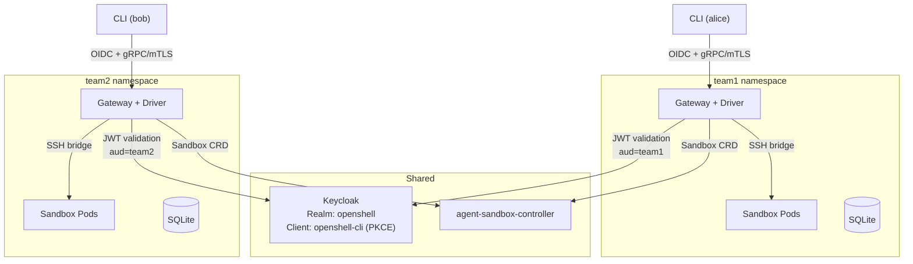

# OpenShell MVP: Gateway-per-Tenant on Kind + OpenShift

**Date:** 2026-04-24
**Status:** Draft
**Supersedes:** [openshell-k8s-integration.md](openshell-k8s-integration.md) (directions only; gap analysis remains valid reference)
**Background:** [openshell-driver-architecture.md](openshell-driver-architecture.md) (driver internals, OIDC analysis, multi-tenancy options)

---

## 1. Goal

Deploy OpenShell on Kind and OpenShift with multi-tenant isolation, OIDC authentication, session persistence, and headless agent execution. Two tenants (team1, team2) prove isolation. No upstream OpenShell code changes required.

**In scope:**

| Capability | Approach |
|------------|----------|
| Multi-tenancy | One gateway per tenant (process isolation) |
| Authentication | OIDC via Keycloak (PR #935) + browser PKCE |
| Compute driver | Fork of [openshell-driver-openshift](https://github.com/zanetworker/openshell-driver-openshift) (out-of-process, Go) |
| Credential resolution | Keycloak credentials driver (OAuth2 client_credentials via driver subsystem) |
| Session persistence | dtach via init container |
| Headless mode | Kagenti `AgentTask` CRD + controller |
| Platforms | Kind (Istio Gateway API) + OpenShift (passthrough Routes) |
| Store | SQLite (one file per gateway instance) |

**Out of scope (see [Section 10](#10-beyond-mvp)):** shared-gateway multi-tenancy, SPIFFE/SPIRE identity, supervisor extensions, transparent proxy-level token exchange (AuthBridge parity), OTel/MLFlow instrumentation (integration points documented in [Section 8](#8-observability-integration-points)), gateway HA, CI client credentials flow.

---

## 2. Architecture

Each tenant gets an isolated OpenShell stack in its own namespace. A shared Keycloak instance provides authentication. The agent-sandbox-controller is shared across the cluster.

```
Cluster
├── keycloak/                      Shared OIDC provider
├── agent-sandbox-system/          Shared CRD controller
├── team1/                         Gateway + driver + sandboxes
│   ├── gateway (StatefulSet)
│   ├── compute-driver (sidecar)
│   ├── SQLite (emptyDir or PVC)
│   ├── Service (ClusterIP)
│   ├── Ingress (TCPRoute or Route)
│   └── sandbox pods
└── team2/                         Same structure, isolated
```



---

## 3. Components

### 3.1 Gateway Pod

Each tenant's gateway runs as a StatefulSet with the compute driver as a sidecar container. They communicate over a Unix domain socket on a shared `emptyDir` volume.

| Container | Image | Role |
|-----------|-------|------|
| `gateway` | Forked `openshell-server` (adds `--compute-driver-socket` flag, ~20 lines Rust) | Control plane, gRPC API, SSH bridge, OIDC validation |
| `compute-driver` | Built from forked `openshell-driver-openshift` (Go) | Sandbox lifecycle via `agents.x-k8s.io/v1alpha1/Sandbox` CRD |
| `credentials-driver` | `openshell-credentials-keycloak` (Go) | OAuth2 token resolution via Keycloak |

The gateway fork is minimal. The upstream VM driver already uses `RemoteComputeDriver` over UDS; the fork adds a generic `External` variant. Upstreaming should be proposed in parallel.

**Gateway environment (per tenant):**

| Env Var | Value | Purpose |
|---------|-------|---------|
| `OPENSHELL_OIDC_ISSUER` | `https://keycloak.<domain>/realms/openshell` | JWT issuer validation |
| `OPENSHELL_OIDC_AUDIENCE` | `team1` or `team2` | Tenant access scoping |
| `OPENSHELL_OIDC_ENABLED` | `true` | Enable OIDC auth |
| `OPENSHELL_DB_URL` | `sqlite:///data/openshell.db` | Per-tenant SQLite |
| `OPENSHELL_COMPUTE_DRIVER_SOCKET` | `/run/drivers/compute.sock` | UDS to compute driver |
| `OPENSHELL_CREDENTIALS_DRIVER_SOCKET` | `/run/drivers/credentials.sock` | UDS to credentials driver |

### 3.2 Compute Driver

Forked from [zanetworker/openshell-driver-openshift](https://github.com/zanetworker/openshell-driver-openshift). Already implements the full `ComputeDriver` gRPC contract (9 RPCs), uses the `agents.x-k8s.io/v1alpha1/Sandbox` CRD, and solves supervisor side-loading with init container + `emptyDir`.

**Changes needed for MVP:**

| Change | Size | Description |
|--------|------|-------------|
| Namespace from config | Small | Read `--namespace` from flag/env. Each tenant's driver targets one namespace. |
| Tenant labels | Small | Add `openshell.ai/tenant: <team>` and `kagenti.io/team: <team>` to sandbox pods |
| Scoped RBAC | Small | Replace demo `cluster-admin` with namespace-scoped Role (sandboxes, pods, secrets) |
| dtach in init container | Small | Add dtach binary to the supervisor-loader init container image |

**What works as-is:** gRPC server, Sandbox CRD CRUD, supervisor init container injection, watch/reconciliation, GPU pre-flight, env var injection, endpoint resolution.

### 3.3 Credentials Driver (Keycloak)

A new out-of-process credentials driver that implements OpenShell's `CredentialsDriver` gRPC contract (`ResolveCredential`, `ListCredentials`). Runs as a third sidecar container in the gateway pod, communicating over UDS.

**How it works:**

```
Agent Process
  │ HTTP request with placeholder credential
  ▼
Supervisor Egress Proxy
  │ resolves placeholder → asks gateway
  ▼
Gateway
  │ calls credentials driver via gRPC
  ▼
Credentials Driver (openshell-credentials-keycloak)
  │ OAuth2 client_credentials grant
  ▼
Keycloak → returns access_token
  │
  ▼ (back through the chain)
Supervisor injects Bearer token into outbound request
```

The key insight is that this fits cleanly into OpenShell's existing credential resolution flow. The supervisor already resolves placeholder credentials through the gateway. The gateway already delegates to a credentials driver. The only new piece is a driver that calls Keycloak instead of reading static secrets.

**What the driver does:**

| Operation | Behavior |
|-----------|----------|
| `ResolveCredential(name)` | Looks up the named credential config (client_id, client_secret, token endpoint, scopes). Calls Keycloak's token endpoint with `grant_type=client_credentials`. Returns the access token. Caches tokens until near-expiry. |
| `ListCredentials` | Returns all configured credential names (e.g., `github-api`, `kagenti-backend`). |

**Configuration per tenant:**

Each tenant's credentials driver has its own config file mapping credential names to Keycloak clients:

```yaml
credentials:
  github-api:
    client_id: team1-github
    client_secret_ref: team1-github-secret  # K8s Secret reference
    token_endpoint: https://keycloak.example.com/realms/openshell/protocol/openid-connect/token
    scopes: ["repo", "read:org"]
  kagenti-backend:
    client_id: team1-kagenti
    client_secret_ref: team1-kagenti-secret
    token_endpoint: https://keycloak.example.com/realms/openshell/protocol/openid-connect/token
    scopes: ["kagenti:read"]
```

Client secrets are stored in Kubernetes Secrets and mounted into the driver container. The driver never persists tokens to disk.

**What this provides vs. what it doesn't:**

| Capability | Provided? |
|------------|-----------|
| OAuth2 client_credentials for outbound calls | Yes |
| Token caching and auto-refresh | Yes |
| Per-tenant credential isolation | Yes (separate driver instance per tenant) |
| Static API key injection (LLM providers) | No — handled by OpenShell's native provider store |
| Transparent proxy-level exchange (AuthBridge-style) | No — agent must use credential placeholders |
| SPIFFE SVID-based token exchange (RFC 8693) | No — beyond MVP |

**Implementation:** Go, matching the compute driver. Estimated ~500 lines. The gRPC contract is defined by OpenShell's `proto/credentials_driver.proto`.

**Open question:** The exact target services for OAuth2 credentials are TBD. The driver is designed to be generic — any Keycloak client can be configured. Initial targets will be determined during implementation.

### 3.4 Sandbox Pod

Created by the agent-sandbox-controller from the Sandbox CRD. The driver configures the pod spec.

```yaml
initContainers:
  - name: supervisor-loader
    image: ghcr.io/nvidia/openshell-community/openshell-sandbox:latest
    command: ["sh", "-c", "cp /usr/local/bin/openshell-sandbox /opt/bin/ && cp /usr/local/bin/dtach /opt/bin/"]
    volumeMounts:
      - name: supervisor-bin
        mountPath: /opt/bin
containers:
  - name: sandbox
    image: <agent-image>
    command: ["/opt/bin/openshell-sandbox"]
    securityContext:
      runAsUser: 0
      capabilities:
        add: [NET_ADMIN, SYS_ADMIN, SYS_PTRACE]
    volumeMounts:
      - name: supervisor-bin
        mountPath: /opt/bin
        readOnly: true
      - name: workspace
        mountPath: /sandbox
volumes:
  - name: supervisor-bin
    emptyDir: {}
  - name: workspace
    persistentVolumeClaim:
      claimName: <sandbox-pvc>
```

The supervisor starts as root, sets up Landlock, Seccomp, and network namespace isolation, then drops privileges before exec'ing the agent process.

> **PodSecurity implication:** The sandbox pod's `runAsUser: 0` and `SYS_ADMIN`/`SYS_PTRACE`/`NET_ADMIN` capabilities require the agent namespace to use the `privileged` Pod Security Standard (or a namespace-scoped exemption policy). This is a deliberate tradeoff — the supervisor needs these privileges to establish kernel-level isolation (Landlock, seccomp, netns) before dropping to unprivileged execution. On OpenShift, this means the namespace needs a `privileged` SCC bound to the sandbox service account.

### 3.5 agent-sandbox-controller

Upstream Kubernetes SIG controller (`registry.k8s.io/agent-sandbox/agent-sandbox-controller`). Reconciles `agents.x-k8s.io/v1alpha1/Sandbox` CRDs into pods and PVCs. Deployed once per cluster in `agent-sandbox-system`.

### 3.6 Keycloak Configuration

Shared Keycloak instance (can be Kagenti's existing Keycloak or a dedicated one).

| Resource | Value |
|----------|-------|
| Realm | `openshell` |
| Client | `openshell-cli` (public, PKCE) |
| Roles | `openshell-admin`, `openshell-user` |
| Users | `alice` (team1, user), `bob` (team2, user), `admin` (both, admin) |
| Groups | `/team1`, `/team2` |

**Audience scoping:** Each gateway validates the `aud` claim. Keycloak includes the audience based on client scope or group membership. Alice gets tokens with `aud=team1`; Bob gets `aud=team2`. A token for team1 is rejected by team2's gateway.

---

## 4. Platform-Specific Configuration

### 4.1 Kind

**Ingress: Shared TLS Gateway + per-tenant TLSRoute**

The gateway requires L4 passthrough (mTLS between CLI and gateway, SSH tunneling inside gRPC). A single shared Istio Gateway in `kagenti-system` handles TLS passthrough for all tenants. Each tenant deploys only a `TLSRoute` that uses SNI (hostname) to route to its backend.

**Shared Gateway** (deployed once by `deploy-shared.sh`):

```yaml
apiVersion: gateway.networking.k8s.io/v1
kind: Gateway
metadata:
  name: tls-passthrough
  namespace: kagenti-system
  annotations:
    networking.istio.io/service-type: NodePort
spec:
  gatewayClassName: istio
  listeners:
    - name: tls-passthrough
      port: 443
      protocol: TLS
      tls:
        mode: Passthrough
      allowedRoutes:
        namespaces:
          from: All
```

**Per-tenant TLSRoute** (deployed by `charts/openshell/` per namespace):

```yaml
apiVersion: gateway.networking.k8s.io/v1alpha2
kind: TLSRoute
metadata:
  name: openshell
  namespace: team1
spec:
  hostnames:
    - "openshell-team1.localtest.me"
  parentRefs:
    - group: gateway.networking.k8s.io
      kind: Gateway
      name: tls-passthrough
      namespace: kagenti-system
      sectionName: tls-passthrough
  rules:
    - backendRefs:
        - name: openshell-server
          port: 8080
```

All tenants share the single Gateway (one Envoy pod in `kagenti-system`, NodePort 30443). SNI hostname distinguishes tenants — no extra Envoy pods per namespace, no port-per-tenant allocation.

**Prerequisites:**
- Kind cluster with Istio installed (Kagenti's `kind-full-test.sh` includes this)
- `agents.x-k8s.io` CRD + controller deployed

### 4.2 OpenShift

**Ingress: Passthrough Route**

```yaml
apiVersion: route.openshift.io/v1
kind: Route
metadata:
  name: openshell
  namespace: team1
  annotations:
    haproxy.router.openshift.io/timeout: 24h
spec:
  host: openshell-team1.apps.<cluster>.<domain>
  port:
    targetPort: grpc
  tls:
    termination: passthrough
  to:
    kind: Service
    name: openshell-server
```

- `termination: passthrough` is mandatory (mTLS, SSH tunneling)
- `timeout: 24h` is mandatory (SSH sessions idle-timeout at 30s default)
- Automatic DNS via `*.apps.<cluster>.<domain>` wildcard

**SCC for sandbox pods:**

```yaml
apiVersion: security.openshift.io/v1
kind: SecurityContextConstraints
metadata:
  name: openshell-sandbox
allowPrivilegedContainer: false
allowHostNetwork: false
allowHostPorts: false
allowHostDirVolumePlugin: false
requiredDropCapabilities:
  - ALL
allowedCapabilities:
  - NET_ADMIN
  - SYS_ADMIN
  - SYS_PTRACE
runAsUser:
  type: RunAsAny
seLinuxContext:
  type: MustRunAs
volumes:
  - emptyDir
  - persistentVolumeClaim
  - secret
  - configMap
```

The SCC is bound to the sandbox service account in each tenant namespace. The gateway and driver containers do not need elevated privileges.

**RBAC (namespace-scoped Role, not ClusterRole):**

```yaml
apiVersion: rbac.authorization.k8s.io/v1
kind: Role
metadata:
  name: openshell-gateway
  namespace: team1
rules:
  - apiGroups: ["agents.x-k8s.io"]
    resources: ["sandboxes"]
    verbs: ["get", "list", "watch", "create", "update", "delete"]
  - apiGroups: [""]
    resources: ["pods", "events", "persistentvolumeclaims"]
    verbs: ["get", "list", "watch"]
  - apiGroups: [""]
    resources: ["secrets"]
    verbs: ["get", "list", "watch", "create"]
---
apiVersion: rbac.authorization.k8s.io/v1
kind: RoleBinding
metadata:
  name: openshell-gateway
  namespace: team1
roleRef:
  kind: Role
  name: openshell-gateway
subjects:
  - kind: ServiceAccount
    name: openshell-gateway
    namespace: team1
```

The gateway can only see resources in its own namespace. Even if compromised, it has zero access to other tenants.

**ResourceQuota per tenant:**

```yaml
apiVersion: v1
kind: ResourceQuota
metadata:
  name: sandbox-quota
  namespace: team1
spec:
  hard:
    pods: "10"
    requests.cpu: "20"
    requests.memory: "40Gi"
    persistentvolumeclaims: "10"
```

---

## 5. Authentication Flow

### 5.1 CLI Login (Browser PKCE)

```
User                    CLI                    Keycloak                Gateway
  │                      │                        │                      │
  │  openshell login     │                        │                      │
  │─────────────────────>│                        │                      │
  │                      │  Authorization Code    │                      │
  │                      │  + PKCE (browser)      │                      │
  │                      │───────────────────────>│                      │
  │  Browser: login form │                        │                      │
  │<─────────────────────│────────────────────────│                      │
  │  Credentials         │                        │                      │
  │─────────────────────>│───────────────────────>│                      │
  │                      │  Auth code callback    │                      │
  │                      │<───────────────────────│                      │
  │                      │  Exchange for tokens   │                      │
  │                      │───────────────────────>│                      │
  │                      │  access_token (JWT)    │                      │
  │                      │  + refresh_token       │                      │
  │                      │<───────────────────────│                      │
  │                      │                        │                      │
  │  openshell sandbox   │                        │                      │
  │  create -- claude    │                        │                      │
  │─────────────────────>│  gRPC + Bearer JWT     │                      │
  │                      │───────────────────────────────────────────────>│
  │                      │                        │  Validate JWT:       │
  │                      │                        │  iss, aud=team1,     │
  │                      │                        │  roles, scopes       │
  │                      │                        │<─────────────────────│
  │                      │                        │                      │
```

Token auto-refresh is handled by the CLI. The refresh token is stored locally. Each gateway validates `aud` matches its tenant name.

### 5.2 RBAC Within a Tenant

PR #935 provides two roles:

| Operation | Required Role |
|-----------|--------------|
| Sandbox CRUD, exec, SSH | `openshell-user` |
| Provider CRUD, config mutations | `openshell-admin` |

Optional scope enforcement (`sandbox:read`, `sandbox:write`, etc.) layers on top.

**Limitation:** Within a tenant, all `openshell-user` members can access all sandboxes. There is no per-user sandbox ownership. This is acceptable for the MVP (teams of 2-5 people sharing a workspace).

---

## 6. Session Persistence (dtach)

### Problem

When the CLI disconnects (network drop, terminal close), the SSH session ends and the sandbox is destroyed (default behavior). With `--keep`, the sandbox pod survives but the agent process is killed because it was running inside the SSH session.

### Solution

[dtach](https://github.com/cribit/dtach) is a minimal (~20KB) statically-compiled process detacher. It is delivered via the same init container as the supervisor binary. Every sandbox has detach/reattach capability without custom images or network egress.

### Usage

**Create a persistent sandbox with dtach:**

```bash
openshell sandbox create --keep -- dtach -c /tmp/session -z claude
```

**Disconnect:** Close the terminal or press `Ctrl-\`. The sandbox pod and agent process continue running.

**Reconnect:**

```bash
openshell sandbox connect <sandbox-id>
dtach -a /tmp/session
```

### Limitations

| Limitation | Impact | Acceptable for MVP? |
|------------|--------|---------------------|
| Pod death kills everything | PVCs survive, session state does not | Yes (ephemeral sessions are expected) |
| User must remember `--keep` + dtach | Without both, disconnect kills the session | Yes (document the pattern) |
| Gateway restart may lose sandbox index | `sandbox connect` may fail until reconciliation | Yes (rare, self-healing) |

---

## 7. Headless Mode (AgentTask CRD)

### Problem

Interactive sandboxes require an SSH connection. For fire-and-forget tasks (refactoring, code review, batch analysis), agents should run unattended.

### Solution

A Kagenti-owned `AgentTask` CRD and controller that creates sandbox pods with the agent command as the entrypoint instead of sshd.

```yaml
apiVersion: kagenti.io/v1alpha1
kind: AgentTask
metadata:
  name: refactor-auth
  namespace: team1
spec:
  image: ghcr.io/nvidia/openshell-community/sandbox:latest
  command: ["claude", "--task", "Refactor the auth module to use JWT"]
  workspace:
    pvc: team1-workspace
    subPath: refactor-auth
  timeout: 2h
  resources:
    limits:
      cpu: "4"
      memory: 8Gi
status:
  phase: Running    # Pending | Running | Succeeded | Failed
  startTime: "2026-04-24T10:00:00Z"
  completionTime: null
```

### Controller Behavior

1. Creates a pod with the same security setup as interactive sandboxes (supervisor init container, capabilities, SCC)
2. Sets the agent command as entrypoint instead of sshd
3. Mounts the PVC workspace for persistent artifacts
4. Sets `AgentTask.status` from the pod's exit state
5. Respects the `timeout` by setting `activeDeadlineSeconds` on the pod

### Credential Injection

In the MVP, headless sandboxes use Kubernetes Secrets mounted into the pod. This is less integrated than the gateway's credential store but functional. Gateway-based credential injection is a beyond-MVP enhancement.

### Debugging

```bash
kubectl exec -it <pod> -n team1 -- /bin/bash
```

Direct access to running headless sandboxes. No SSH tunnel needed.

---

## 8. Observability Integration Points

Observability (OTel/MLFlow) is **not implemented in the MVP** but the following integration points are identified for future work:

| Component | What to instrument | Sink |
|-----------|--------------------|------|
| Gateway | Sandbox lifecycle events (create, delete, connect, disconnect) | OTel traces |
| Gateway | Provider CRUD operations | OTel traces |
| Supervisor egress proxy | HTTP CONNECT requests (target, method, status, latency) | OTel spans |
| Supervisor egress proxy | LLM API calls (model, tokens in/out, latency, cost) | MLFlow |
| Compute driver | CRD reconciliation events, watch latency | OTel metrics |
| AgentTask controller | Task lifecycle (pending, running, succeeded, failed, duration) | OTel traces |

The supervisor's egress proxy is the critical instrumentation point for LLM observability. Every agent-to-LLM call passes through it, making it the natural place to capture token counts, latency, and cost per sandbox/tenant.

---

## 9. Deployment and Validation

### 9.1 Deployment Steps

1. **Cluster setup**
   - Kind: `kind-full-test.sh` (includes Istio)
   - OpenShift: existing cluster with Istio ambient or standard ingress

2. **Shared infrastructure** (`scripts/openshell/deploy-shared.sh`)
   - Deploy `agents.x-k8s.io` Sandbox CRD + agent-sandbox-controller
   - Gateway API experimental CRDs (TLSRoute/TCPRoute, Kind only)
   - Shared TLS passthrough Gateway in `kagenti-system` (Kind only)
   - cert-manager CA chain (ClusterIssuer + CA Certificate)
   - Deploy Keycloak with `openshell` realm, PKCE client, users (alice/team1, bob/team2, admin/both)

3. **Per-tenant deployment** (`scripts/openshell/deploy-tenant.sh`, repeat for team1 and team2)
   ```bash
   scripts/openshell/deploy-tenant.sh team1
   scripts/openshell/deploy-tenant.sh team2
   ```
   Under the hood this runs:
   ```bash
   helm upgrade openshell-team1 charts/openshell/ --install \
     --namespace team1 \
     --set oidc.issuer="http://keycloak-service.keycloak.svc.cluster.local:8080/realms/openshell" \
     --set oidc.audience="team1" \
     --set driver.namespace="team1" \
     --set ingress.type="istio" \
     --set ingress.host="openshell-team1.localtest.me"
   ```

4. **CLI configuration**
   ```bash
   # Alice (team1) — port 30443 is the shared gateway NodePort
   openshell gateway set --url https://openshell-team1.localtest.me:30443
   openshell login   # Browser PKCE flow
   ```

### 9.2 Validation Criteria

| # | Test | Pass Condition |
|---|------|----------------|
| 1 | Sandbox lifecycle | `sandbox create -- claude` creates pod, `sandbox delete` removes it |
| 2 | SSH connectivity | `openshell term` opens interactive session inside sandbox |
| 3 | OPA policy enforcement | Blocked egress target returns connection refused |
| 4 | Provider credential injection (static) | Agent can call LLM API via injected API key credentials |
| 5 | OAuth2 credential resolution | Credentials driver resolves a Keycloak client_credentials grant and the token is injected into an outbound request |
| 6 | Tenant isolation (auth) | Alice's JWT (`aud=team1`) is rejected by team2's gateway |
| 7 | Tenant isolation (RBAC) | team1's gateway SA cannot list sandboxes in team2 namespace |
| 8 | Credential isolation | Providers created on team1's gateway are invisible from team2 |
| 9 | Session persistence | Disconnect + reconnect with dtach restores session |
| 10 | Headless execution | AgentTask CRD creates pod, runs task, reports status |
| 11 | OpenShift SCC | Sandbox pod runs with custom SCC, SELinux enforcing (OpenShift only) |

---

## 10. Beyond MVP

These items are explicitly deferred. Each has a documented path in [openshell-driver-architecture.md](openshell-driver-architecture.md).

| Item | Why Deferred | Reference |
|------|-------------|-----------|
| **Shared-gateway multi-tenancy** | Requires 5 upstream changes (thread Identity, tenant labels, list filtering, ownership checks, provider scoping) | driver-architecture.md Section 3.7 |
| **SPIFFE/SPIRE sandbox identity** | Replaces shared mTLS certs; requires trust domain design and supervisor SPIRE client | driver-architecture.md Section 7.2 |
| **Transparent proxy-level token exchange** | Full AuthBridge parity: supervisor egress proxy detects OAuth2 targets and injects tokens automatically. Requires upstream supervisor changes. MVP uses credential placeholders instead. | driver-architecture.md Section 2 (Approach B) |
| **SVID-based token exchange (RFC 8693)** | Exchange SPIFFE SVID for OAuth2 token. Requires SPIRE integration (beyond MVP) + Keycloak token exchange grant. | driver-architecture.md Section 7.3 |
| **Supervisor extensions** (SPIRE, mTLS origination) | General-purpose upstream contributions; not needed for process-isolated MVP | driver-architecture.md Section 7.3 |
| **OTel/MLFlow instrumentation** | Integration points documented in Section 8; implementation requires upstream proxy instrumentation | driver-architecture.md Section 7.6 |
| **Gateway HA** | Single-instance per tenant is acceptable for MVP; externalized state needed for replicas | k8s-integration.md Section 5.3 |
| **CI client credentials flow** | PR #935 supports it; MVP focuses on browser PKCE for human users | driver-architecture.md Section 4 |
| **Full Kagenti driver suite** (4 drivers) | MVP builds compute + credentials drivers; CP identity and sandbox identity drivers are future | driver-architecture.md Section 7.4 |
| **Policy hierarchy and templates** | Each tenant manages policies independently for now | k8s-integration.md Section 5.4 |
| **Sandbox TTL / hibernation** | CronJob cleanup as workaround; upstream feature needed for proper lifecycle | k8s-integration.md Section 5.7 |
| **Upstream gateway fork elimination** | Propose `--compute-driver-socket` flag upstream in parallel with MVP | driver-architecture.md Section 6 |
| **Gateway-level session management** | Auto-wrap in dtach, session broker, session listing API | k8s-integration.md Section 6 |
| **AgentTask gateway integration** | Gateway handles credential injection for headless pods, `sandbox attach` debugging | k8s-integration.md Section 6 |

---

## 11. Prerequisites and Dependencies

| Dependency | Status | Risk |
|------------|--------|------|
| [PR #935](https://github.com/NVIDIA/OpenShell/pull/935) (OIDC auth) | In review | Low — active PR, can run from branch |
| [openshell-driver-openshift](https://github.com/zanetworker/openshell-driver-openshift) | Published | Low — fork and adapt |
| Gateway fork (`--compute-driver-socket`, `--credentials-driver-socket`) | ~40 lines Rust | Low — uses existing `RemoteComputeDriver` pattern |
| Credentials driver proto (`proto/credentials_driver.proto`) | Defined by OpenShell | Low — implement against existing contract |
| [agent-sandbox-controller](https://github.com/kubernetes-sigs/agent-sandbox) | Published | Low — upstream K8s SIG project |
| Keycloak | Kagenti ships with Keycloak | None |
| Istio (Kind) | Kagenti ships with Istio | None |
| Supervisor binary image | Published by NVIDIA | None |

---

## 12. Open Items

| # | Question | Impact | Status |
|---|----------|--------|--------|
| 1 | Supervisor + SELinux on OpenShift | May need custom SELinux policy module | Needs testing in Phase 1 |
| 2 | Supervisor binary version pinning | Must match gateway version? Compatibility matrix? | Check upstream docs |
| 3 | Keycloak audience claim mechanism | Client scope vs group mapper for per-tenant `aud` | Design during Keycloak setup |
| 4 | dtach licensing | Redistribution in init container image | Verify (GPL v2) |
| 5 | Kind Istio Gateway port allocation | One port per tenant vs SNI-based routing | Design during Kind setup |

---

## 13. Implementation Plan and PoC Alignment

This section maps the MVP architecture to concrete implementation steps and
reconciles with the existing PoC work in
[PR #1300](https://github.com/kagenti/kagenti/pull/1300) (code) and
[PR #1319](https://github.com/kagenti/kagenti/pull/1319) (architecture docs).

### 13.1 Repos to Fork

The MVP requires 3 upstream repos forked into the `kagenti` org, plus 1 new repo:

| Upstream | Fork to | Changes | Size |
|----------|---------|---------|------|
| [NVIDIA/OpenShell](https://github.com/NVIDIA/OpenShell) | `kagenti/openshell` | Add `--compute-driver-socket` + `--credentials-driver-socket` flags (~40 lines Rust), cherry-pick PR #935 (OIDC) | Small |
| [zanetworker/openshell-driver-openshift](https://github.com/zanetworker/openshell-driver-openshift) | `kagenti/openshell-driver-openshift` | Namespace from config flag, tenant labels, scoped RBAC, dtach in init container | Small |
| [kubernetes-sigs/agent-sandbox](https://github.com/kubernetes-sigs/agent-sandbox) | No fork needed | Deploy upstream image as-is | None |

| New repo | Purpose |
|----------|---------|
| `kagenti/openshell-credentials-keycloak` | Go credentials driver (~500 lines), implements `CredentialsDriver` gRPC contract for OAuth2 `client_credentials` via Keycloak |

### 13.2 Script Architecture

The MVP replaces the two divergent deployment paths (PR #1300's kustomize-based
`openshell-full-test.sh` and the Phase 0 Helm-based `scripts/kind/openshell/setup.sh`)
with a layered script architecture that works on Kind, OpenShift, and CI.

```
openshell-full-test.sh (orchestrator — thin, calls the others)
  │
  ├── scripts/openshell/build-images.sh      Build forked images (Kind or OCP)
  ├── scripts/openshell/deploy-shared.sh     Shared infra (cert-manager CA, sandbox controller, Keycloak realm)
  ├── scripts/openshell/deploy-tenant.sh     Per-tenant gateway stack (helm install)
  └── scripts/openshell/configure-cli.sh     Extract certs for local dev (optional)
```

#### `scripts/openshell/build-images.sh`

Builds the 3 forked/new images for the target platform:

- Gateway fork (`kagenti/openshell`)
- Compute driver (`kagenti/openshell-driver-openshift`)
- Credentials driver (`kagenti/openshell-credentials-keycloak`)

On Kind: `docker build` + `kind load docker-image`. On OpenShift: Shipwright Build
or `oc start-build`.

#### `scripts/openshell/deploy-shared.sh`

Deploys cluster-wide components (idempotent):

1. **agent-sandbox-controller** — upstream image, `agent-sandbox-system` namespace
2. **Gateway API experimental CRDs** — for TLSRoute/TCPRoute (Kind only, OCP has Routes)
3. **Shared TLS passthrough Gateway** — single Istio Gateway in `kagenti-system` with `allowedRoutes.namespaces.from: All`, NodePort 30443 (Kind only, OCP uses Routes)
4. **cert-manager CA chain** — `ClusterIssuer` + CA `Certificate` (see [Section 13.3](#133-tls-via-cert-manager))
5. **Keycloak realm** — `openshell` realm, `openshell-cli` PKCE client, users (alice/team1, bob/team2, admin/both), audience mappers

#### `scripts/openshell/deploy-tenant.sh <team>`

Deploys one tenant's gateway stack via the `charts/openshell/` Helm chart:

- Namespace creation + labels (`shared-gateway-access=true`, `openshell.ai/tenant`)
- cert-manager `Certificate` CRs for server TLS + client mTLS (signed by shared CA)
- Gateway `StatefulSet` with compute-driver + credentials-driver sidecars
- `Service` (ClusterIP), namespace-scoped `Role`/`RoleBinding`
- Platform-specific ingress: Istio `TLSRoute` referencing shared gateway (Kind) or passthrough `Route` (OpenShift)
- `ResourceQuota`
- Auto-detects Kind vs OCP, constructs OIDC issuer URL from Keycloak service discovery

Invocation: `deploy-tenant.sh team1` and `deploy-tenant.sh team2`.

#### `scripts/openshell/configure-cli.sh <team>`

Dev-only script that extracts cert-manager-generated client certs from K8s
secrets and writes `~/.config/openshell/gateways/<context>/`. Not needed in CI.

#### Updated `openshell-full-test.sh`

Becomes a thin orchestrator:

```
Phase 1: Cluster create           (existing kind/hypershift scripts)
Phase 2: Kagenti platform install (existing Helm installer) [Note: Ansible installer removed]
Phase 3: build-images.sh          (forked gateway + drivers)
Phase 4: deploy-shared.sh         (sandbox controller, cert-manager CA, Keycloak realm)
Phase 5: deploy-tenant.sh team1   (gateway + driver + ingress)
         deploy-tenant.sh team2
Phase 6: E2E tests                (adapted from PR #1300 test suite)
Phase 7: Cluster destroy           (existing scripts)
```

#### `charts/openshell/` Helm Chart

New Helm chart for per-tenant deployment. Templated values:

| Value | Example | Purpose |
|-------|---------|---------|
| `oidc.issuer` | `https://keycloak.../realms/openshell` | JWT issuer for gateway validation |
| `oidc.audience` | `team1` | Tenant-scoped audience claim |
| `driver.namespace` | `team1` | Compute driver target namespace |
| `ingress.type` | `istio` or `route` | Platform-specific ingress |
| `ingress.host` | `openshell-team1.localtest.me` | Ingress hostname (SNI routing key) |
| `ingress.gatewayName` | `tls-passthrough` | Shared Istio Gateway name (Kind) |
| `ingress.gatewayNamespace` | `kagenti-system` | Namespace of shared Gateway (Kind) |
| `tls.issuerRef` | `openshell-ca-issuer` | cert-manager issuer for leaf certs |

### 13.3 TLS via cert-manager

All three existing TLS approaches are replaced by cert-manager `Certificate` CRs,
following the pattern already established by Kagenti's Shipwright integration
(`deployments/ansible/roles/kagenti_installer/tasks/04_install_shipwright.yaml`) [historical reference — Ansible installer removed].

**What this replaces:**

| Previous approach | Where | Problem |
|-------------------|-------|---------|
| Helm `genCA`/`genSignedCert` template patch | `scripts/kind/openshell/setup.sh` | Patches upstream Helm chart, Helm-only, no auto-renewal |
| Empty placeholder secrets + `--disable-tls` | PR #1300 `deployments/openshell/tls-secrets.yaml` | TLS disabled in PoC, manual openssl commands for production |
| Manual `openssl` commands | Documented in PR #1300 tls-secrets.yaml comments | Manual, error-prone, no renewal |

**Shared CA (deployed by `deploy-shared.sh`):**

```yaml
# Step 1: Bootstrap issuer
apiVersion: cert-manager.io/v1
kind: ClusterIssuer
metadata:
  name: openshell-selfsigned
spec:
  selfSigned: {}
---
# Step 2: Root CA certificate
apiVersion: cert-manager.io/v1
kind: Certificate
metadata:
  name: openshell-ca
  namespace: cert-manager
spec:
  isCA: true
  commonName: openshell-ca
  secretName: openshell-ca-secret
  duration: 87600h    # 10 years
  renewBefore: 720h   # 30 days
  privateKey:
    algorithm: ECDSA
    size: 256
  issuerRef:
    name: openshell-selfsigned
    kind: ClusterIssuer
---
# Step 3: CA issuer (signs tenant leaf certs)
apiVersion: cert-manager.io/v1
kind: ClusterIssuer
metadata:
  name: openshell-ca-issuer
spec:
  ca:
    secretName: openshell-ca-secret
```

**Per-tenant leaf certs (templated in `charts/openshell/`):**

```yaml
# Server TLS certificate (gateway)
apiVersion: cert-manager.io/v1
kind: Certificate
metadata:
  name: openshell-server-tls
  namespace: {{ .Values.tenant }}
spec:
  secretName: openshell-server-tls
  duration: 8760h     # 1 year
  renewBefore: 720h   # 30 days
  dnsNames:
    - openshell-server
    - openshell-server.{{ .Values.tenant }}
    - openshell-server.{{ .Values.tenant }}.svc
    - openshell-server.{{ .Values.tenant }}.svc.cluster.local
    - localhost
  issuerRef:
    name: openshell-ca-issuer
    kind: ClusterIssuer
---
# Client mTLS certificate (CLI authentication)
apiVersion: cert-manager.io/v1
kind: Certificate
metadata:
  name: openshell-client-tls
  namespace: {{ .Values.tenant }}
spec:
  secretName: openshell-client-tls
  duration: 8760h
  renewBefore: 720h
  commonName: openshell-client
  usages:
    - client auth
  issuerRef:
    name: openshell-ca-issuer
    kind: ClusterIssuer
```

**Advantages over previous approaches:**

- Auto-renewal (cert-manager watches expiry, rotates before `renewBefore`)
- Works on both Kind and OpenShift (cert-manager is a Kagenti platform dependency)
- No upstream chart patching, no manual openssl, no placeholder secrets
- Follows existing Kagenti convention (Shipwright, Istio shared trust)
- Kustomize and Helm compatible (Certificate CRs are standard K8s resources)

### 13.4 What Gets Retired

| Current artifact | Replaced by | Notes |
|------------------|-------------|-------|
| `scripts/kind/openshell/setup.sh` | `deploy-shared.sh` + `deploy-tenant.sh` + `configure-cli.sh` | Kind-only Phase 0 script, Helm-based |
| `deployments/openshell/` kustomize (PR #1300) | `charts/openshell/` Helm chart | Kustomize manifests with `--disable-tls` |
| `deployments/openshell/tls-secrets.yaml` | cert-manager Certificate CRs | Empty placeholder secrets |
| Helm `genCA`/`genSignedCert` template patch | cert-manager Certificate CRs | Injected into upstream chart at runtime |
| `openshell-full-test.sh` Phase 3 inline kustomize | `deploy-shared.sh` + `deploy-tenant.sh` calls | Monolithic deploy logic |

### 13.5 Alignment with PR #1319 Architecture Docs

PR #1319 documents the PoC architecture (single gateway, `--disable-tls`, 7 agent
types, 117 E2E tests). The MVP diverges from the PoC in several areas. This table
maps where the architecture docs remain valid and where they need updates:

| PR #1319 section | MVP status | Action needed |
|------------------|------------|---------------|
| §2 Current PoC Architecture | **Superseded** — single gateway replaced by gateway-per-tenant | Update diagram to show per-tenant stacks |
| §3 Agent Deployment Tiers | **Valid** — 3-tier model (Tier 1/2/3) still applies | No change |
| §4 Sandboxing Layers | **Valid** — supervisor, Landlock, seccomp, netns unchanged | No change |
| §5 Credential Isolation | **Extended** — MVP adds Keycloak credentials driver alongside existing provider store | Add credentials driver to the flow |
| §6 Target Architecture (Phase 2) | **Partially implemented** — compute driver is MVP, backend/UI integration is beyond MVP | Clarify which parts land in MVP |
| §7 OpenShell RFC 0001 | **Valid** — driver subsystem mapping unchanged | No change |
| §8 Security: Init Container Pattern | **Implemented** — compute driver fork uses init container for supervisor delivery | Mark as done |
| §9 LLM Compatibility Matrix | **Valid** — same agent/CLI compatibility | No change |
| §10 Egress Policy Enforcement | **Valid** — same supervisor enforcement model | No change |
| §11 Phase 1 PoC Results | **Valid** — historical results, still applicable as baseline | No change |
| §12 Phase 2 Backend/UI Integration | **Deferred** — beyond MVP scope | Annotate as post-MVP |
| §13 TODO: Production Readiness | **Partially addressed** — TLS via cert-manager (HIGH), init container (HIGH), scoped RBAC (MEDIUM) | Update status column |

### 13.6 Implementation Order

| Step | Deliverable | Depends on |
|------|-------------|------------|
| 1 | Fork `NVIDIA/OpenShell` → `kagenti/openshell` | — |
| 2 | Fork `zanetworker/openshell-driver-openshift` → `kagenti/openshell-driver-openshift` | — |
| 3 | Gateway fork: `--compute-driver-socket` + `--credentials-driver-socket`, cherry-pick PR #935 | Step 1 |
| 4 | Compute driver: namespace flag, tenant labels, scoped RBAC, dtach in init container | Step 2 |
| 5 | Create `kagenti/openshell-credentials-keycloak` — implement `CredentialsDriver` gRPC | — |
| 6 | `scripts/openshell/build-images.sh` | Steps 3, 4, 5 |
| 7 | `scripts/openshell/deploy-shared.sh` (cert-manager CA, sandbox controller, Keycloak realm) | — |
| 8 | `charts/openshell/` Helm chart (per-tenant gateway stack with cert-manager leaf certs) | Step 7 |
| 9 | `scripts/openshell/deploy-tenant.sh` (wraps Helm install with platform detection) | Step 8 |
| 10 | `scripts/openshell/configure-cli.sh` (extract certs for local dev) | Step 7 |
| 11 | Update `openshell-full-test.sh` as thin orchestrator | Steps 6–9 |
| 12 | E2E tests — adapt PR #1300 test suite for multi-tenant validation criteria (Section 9.2) | Step 11 |

Steps 1–2, 5, and 7 have no dependencies and can start in parallel.
